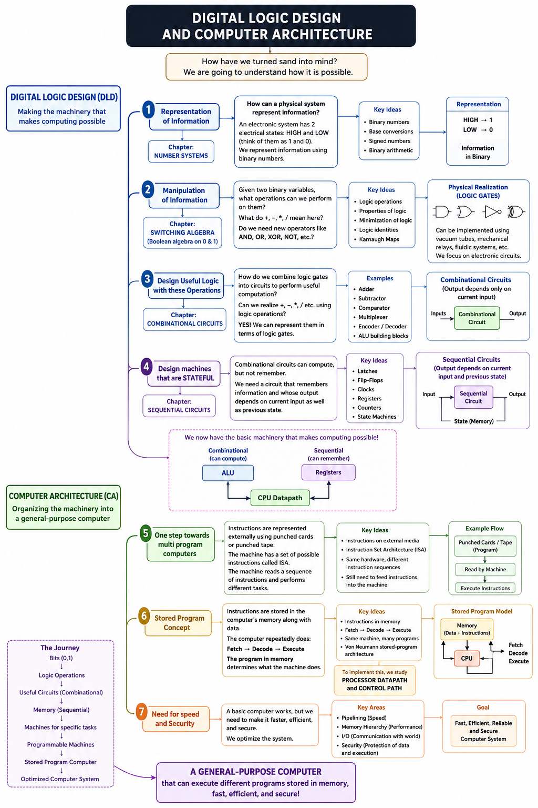

# Digital Logic Design and Computer Architecture.

“How have we turned sand into mind?” This is the question that we always have when we look at the computer. In this course, we are going to understand how it is possible.

A computer is something that computes. Computes what? computes some mathematical problems. This means if there is something that can be represented mathematically, this computer computes it. Be it the speed of the car in that car game, or the way light travels from a given angle etc. Now the question is, how are we going to represent this mathematical problem in a way that this computer understands?

## 1. Representation of Information
Before building anything, we need to answer

>“How can a physical system represent information”. 

Given that a computer is an electronic device, it can be in 2 electrical states. which are HIGH and LOW. We can think of them as 1 and 0. This means we can represent information in the form of binary numbers. 

So in this chapter **NUMBER SYSTEMS** we learn how numbers are represented.

## 2. Manipulation of Information
Now, "given two binary variables, what mathematical operations can we perform on them", like can we use '+' between 0 and 1, 

what does '+' mean here. if there is a '+', then is there a minus? or '*' or '/'. does these operations have any meaning? or do we need new operators that give them meaning. like for example OR , AND, XOR etc. 

All these new operators and their properties and hence minimizing them so that we don't use redundant logic is learnt in this chapter **SWITCHING ALGEBRA** ( i.e Boolean algebra restricted to two values 0 and 1)"

These operations on binary variables can be physically realized using devices called logic gates. The same logical operation can be implemented in many different physical forms, like for example, using *vacuum tubes, mechanical relays, fluidic mechanisms, or other physical systems*. However, in this course, we will focus specifically on realizing these logical operations using **CMOS electronic circuits**.

## 3. Design Useful Logic with these Operations
We have represented numbers in binary. We have also understood how to manipulate those binary numbers along with realising them physically and called them logic gates.

Now the question is 

> "How do we combine these logic gates into circuits to perform useful computation?"

i.e. can we realise ‘+’, ‘-’, ‘/’, ‘*’ etc using these logic operations?

The answer is in fact a YES. We CAN represent these useful operations in terms of switching algebra or Logic gates. 
Some examples are ADDER, SUBTRACTOR, COMPARATOR, MULTIPLEXER etc.

All these we are going to learn in the chapter **COMBINATIONAL CIRCUITS**

## 4. Design machines that are STATEFUL
Combinational circuits can give us computation, but not memory. Their output depends only on the current input. To build more capable machines, we need a way for a circuit to remember information and allow its output to depend not only on the current input but also on its previous state.

This is what we study in the chapter **SEQUENTIAL CIRCUITS**. We learn how to store and update state using components such as latches and flip-flops, and how to coordinate state changes using clocks. These building blocks can then be combined to create registers, counters, and state machines.

In short, Combinational circuits can compute. Sequential circuits can remember.

congratulations. At this point, we have machinery that makes computing possible. 

```
Combinational ────> ALU ────────┐
                                ├───> CPU Datapath
Sequential ───────> Registers ──┘
```

## End of Digital Logic Design and start of Computer Architecture
This is where we conclude the Digital Logic Design part and Computer Architecture part begins

DLD teaches us how to build the hardware machinery that makes computation possible. At this point, we know how to construct combinational circuits that can perform computation and sequential circuits that can store state and change their behavior over time. We have the building blocks required to construct machines such as ALUs, registers, counters, and control circuits.

Using these building blocks, we can already design a complete machine that performs a particular task. For example, we could build a state machine that controls a washing machine, a traffic light, or an elevator. Such a machine receives inputs, remembers its current state, and changes its behavior according to predefined rules. At this point, a program is nothing but the circuit itself.

However, such machines are designed for a specific behavior i.e a single program. The sequence of operations they perform is essentially determined by their hardware and control logic. If we want the same machine to perform a fundamentally different task or different programs, we generally need to redesign its hardware or change its control logic.

This was similar to the problem faced by early computers.

In the earliest machines, changing the task often meant physically reconfiguring the machine. Wires could be reconnected, switches changed, or plugboards reconfigured to change how the machine performed a computation. Instead of simply giving the machine a new program, humans had to manually configure the hardware to determine what the machine would do.

This was a major limitation. Reconfiguring a machine could be time-consuming and inconvenient, especially if we wanted the same machine to perform many different tasks.
## 5. One step towards multi program computers
One step toward solving this problem was to represent instructions externally using media such as punched cards or punched tape. The machine would have a set of possible instructions called as **INSTRUCTION SET ARCHITECTURE (ISA)** and it could read a sequence of those instructions from these media, allowing the same hardware to perform different tasks without completely rewiring the machine. However, the instructions still existed externally and had to be fed into the machine.


## 6. Stored Program Concept
The next major conceptual leap was the stored-program concept.
Instead of permanently defining the machine's behavior in hardware, or keeping the instructions separate from the machine, the instructions themselves could be stored in the computer's memory. A computer could then repeatedly:

> **Fetch an instruction → Decode it → Execute it**

The sequence of instructions—the program—could now determine what the machine did.

This meant that the same physical machine could perform entirely different tasks simply by changing the program stored in memory. A calculator, a game, a compiler, or a scientific simulation could all run on the same underlying hardware.

This idea is closely associated with the von Neumann stored-program architecture, which became the foundation for most modern general-purpose computers.

To implement this technique where the CPU Fetch, then decodes and execute etc, we study the topic of **PROCESSOR DATAPATH and CONTROL PATH**

## 7. Need for speed and Security
The above information is enough to build a working computer. Now to optimize it and make it fast and secure, we learn **PIPELINING**, **MEMORY HIERARCHY**, and **I/O**.

That is how we are going to cover all topics in DLDCA.
