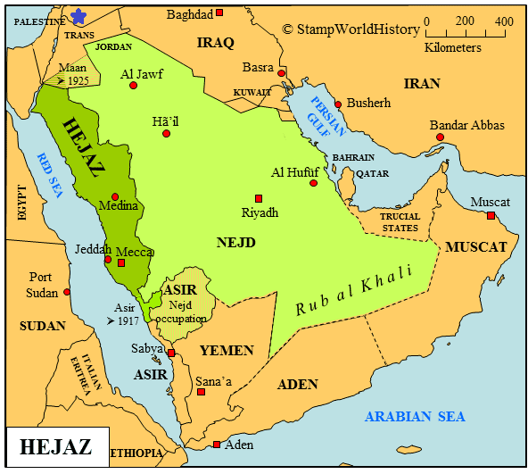
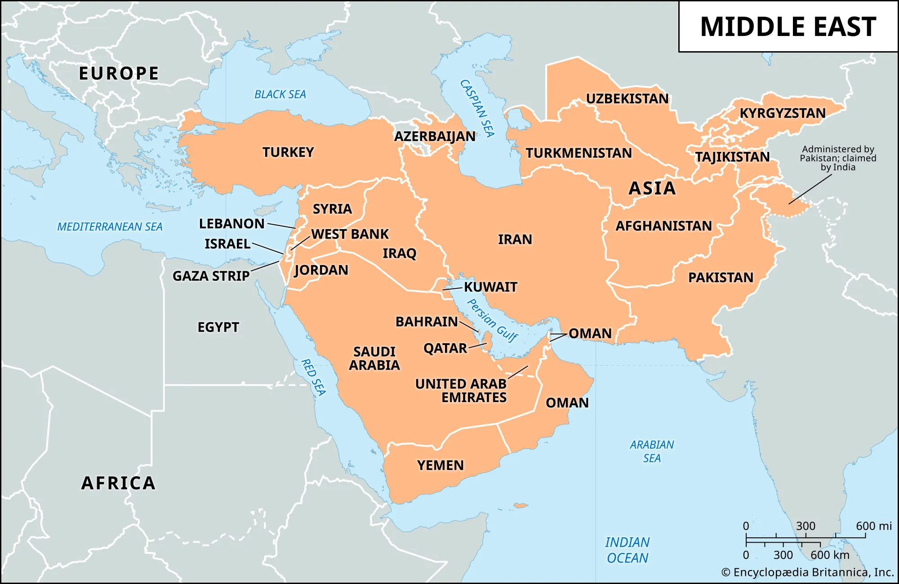

## Types of Arabs

- There are two kinds of Arabs
	- The original Arabs (اَلْعَرَبُ الْعَارِبَةُ) - Arab al Ariba
	- The Arabized Arabs (اَلْعَرَبُ الْمُسْتَعْرِبَةُ) - Arab al Mustariba
- Among the people of Arab al Ariba were [Ad(عادٌ)](Types%20of%20arabs/Ad(عادٌ).md), [Thamud( ثَمُودُ)](./Types%20of%20arabs/Thamud(%20ثَمُودُ).md), [Tasm( طَسْمٌ)](./Types%20of%20arabs/Tasm(%20طَسْمٌ).md), [Jadis(جَدِيسُ)](./Types%20of%20arabs/Jadis(جَدِيسُ).md), [Umaym(أُمَيْمُ)](./Types%20of%20arabs/Umaym(أُمَيْمُ).md), [Jurhum(جُرْهُمُ)](./Types%20of%20arabs/Jurhum(جُرْهُمُ).md), [Amaliq(عَمَالِيقُ)](./Types%20of%20arabs/Amaliq(عَمَالِيقُ).md) and others only known to Allah. These people were present during and even before the time of Prophet Abraham (A.S).
- However these people are not anymore. All the Arabs that are present currently are the descendants of Ishmael (A.S)

## About Qahtan and his lineage
- The Arabs of the Yemen are known as the Himyar (حِمْيَرُ). These people are well known to have been from Qahtan (قَحْطَانُ).
- Who is Qahtan? Different people has different opinions
	1.  Some say that Qahtan is son of Hud or Hud himself or Hud's brother or one of Hud's offspring
	2.  Some other (one of them being [Ibn Ishaq ( اِبْنُ إِسْحَاقَ)](./Islamic%20scholars/Ibn%20Ishaq%20(%20اِبْنُ%20إِسْحَاقَ).md)) say that Qahtan is a descendant of Ishmael (A.S) . One authority gives the lineage as Qahtan b. al-Hamysa b. Tayman b. Qaydhar b. Nabt b. Ishmael.  Al bukhari claims that Prophet (SAW) said to a group from Aslam "Combat O sons of Ishmael". Now this person Aslam(أَسْلَمُ) b. Afsa(أَفْصَى) b. Haritha( حَارِثَةُ) b. Amr(عَمْرُو) b. Amir(عَامِرُ) is from the tibe of Khuzaa( خُزَاعَةُ). This tribe Khuzaa is from Saba b. Qahtan.
	3.  And the third and overwhelming view is that Qahtani Arabs are not from Ishmael. (whether they are from Yemen or somewhere else)
 

## New classification of Arabs
Since there are some issues with the previous classification, a new classification of Arabs will be given from now on. Most consider that all the Arabs are divided into two strains 
- Qahtani -  Those from Qahtan
- Adnani -  Those from Adnan

> One thumb rule is that
>
> Qahtani means **Arabs of Yemen (Himyar)** and
>
> Adnani means **Arabs of Hijaz**. look at the map above

Qahtani Arabs are further classified into **Saba** and **Hadramawt**. Where as Adnani Arabs are classified into **Rabiah** and **Mudar**.

One more lineage but this is the object of dispute is Qudaa. 
Some say they are Adnani while other claims they are Qahtani. There is also a hadith that supports they are Qahtani.

The taxonomy has the following order.
- **Shuʿūb (شُعُوبٌ)** - Great nations/Peoples
- **Qabāʾil (قَبَائِلُ)** - Tribes
- **ʿAmāʾir (عَمَائِرُ)** - Tribal confederations/Large branches
- **Buṭūn (بُطُونٌ)** - Sub-tribes
- **Afkhādh (أَفْخَاذٌ)** - Small divisions/Clans
- **Faṣāʾil (فَصَائِلُ)** - Extended kinsfolk
- **ʿAshāʾir (عَشَائِرُ)** - Extended families

## About Qahtan

- A hadith says that Prophet (SAW) said: "Judgement Day will not come until a man from the Qahtan goes forth driving the people before him with his stick"
- Qahtan was the first to whom were spoken the phrases abayta al-la'na  (i.e. “you have scorned the malediction”) and an'im sabahan (i.e. “have a happy morning! ”).
- There is one more hadith that mentions his name where Rasool-Allah (SAW) said: "This status once belonged to Himyar(yemen arabs), but God withdrew it from them and placed it with Quraysh and *waw, sin, ya, ayn, waw, dal, alif , hamza, lam, ya, ha, mim* .’" which basically combinedly studies says wa saya'udu ilayhim meaning ‘it will return to them'. Now what status and all we dont know yet. we shall know as we proceed InshaAllah.

Summary:
- Arabs classification based on Ishmael
- About Qahtan and a new type of classification
- Qahtan, Adnan, Saba, Hadramawt, Rabia, Mudar, Qudaa
- About Qahtan

We continue with Saba, Hadramawt then move to Adnan's lineage InshaAllah

next: [2. The story of Saba](./2_The_story_of_Saba.md)