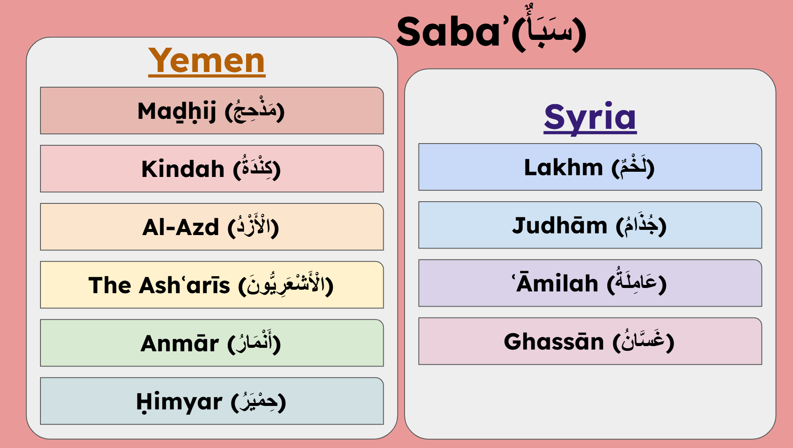
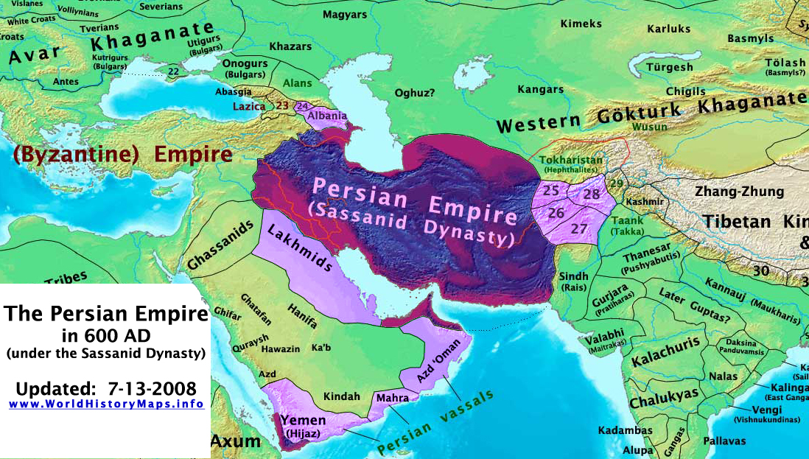
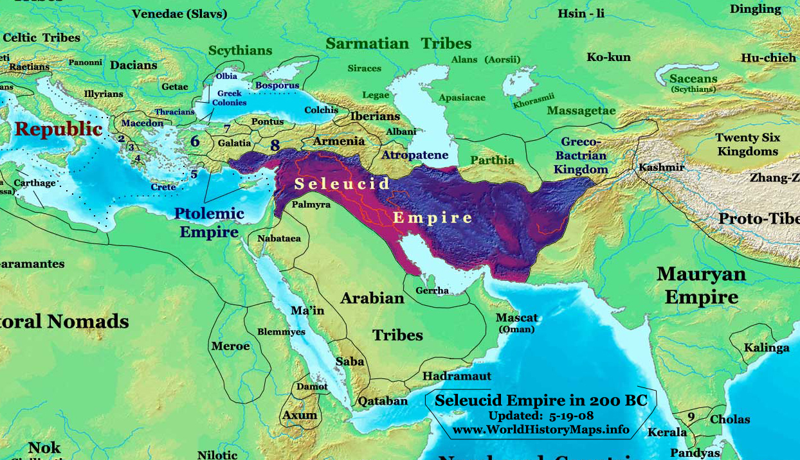
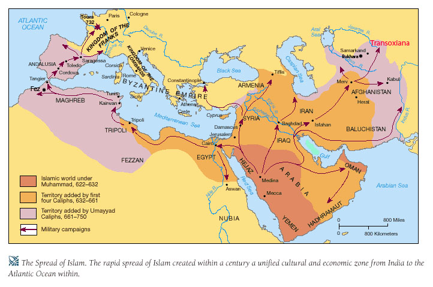
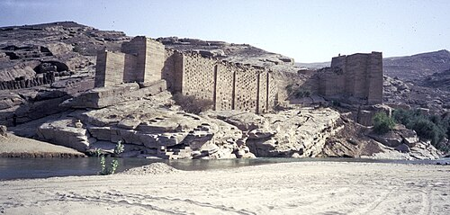
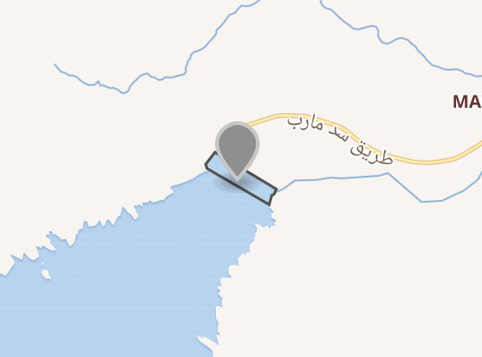
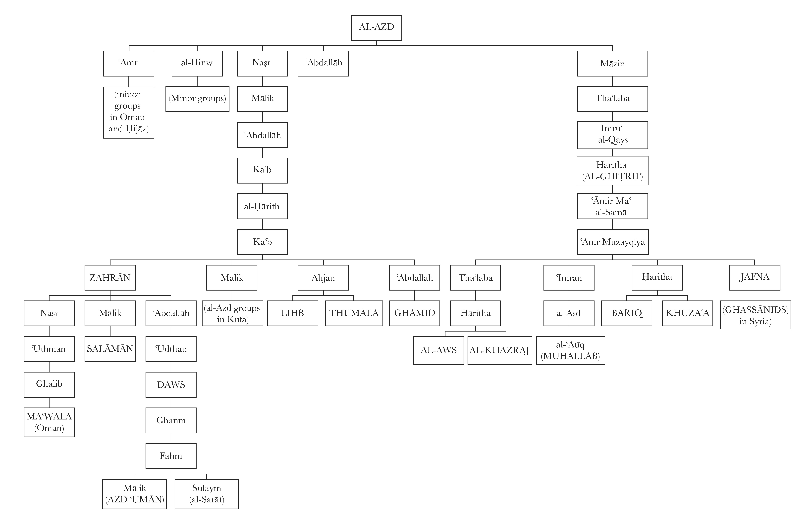
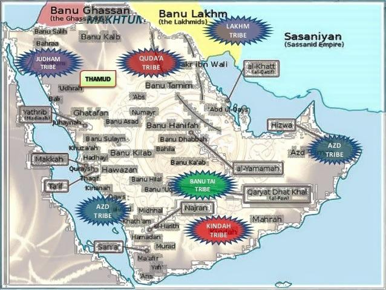

## Background of Saba

- Saba is a man whose full name is given as **Saba' 'Abd Shams b. Yashjub b. Ya'rub b. Qahtan**
- He was the first of the Arabs who "saba" which means to take captives.
- He was also called as al-Raish which means "the philontropist" because he gave to the people from his own wealth.
- It is related that he was the first person to be crowned.
- Some stated that he was a Muslim and predicted the advent of Prophet (SAW)

> The poem
>
> “He will control after us a mighty domain
>
> A prophet who will give not licence to evil.
>
> After him, other kings from among them will hold sway 
>
> Ruling all men, with no dishonour nor disgrace.
>
> After them, rulers of ours will control 
>
> And our kingdom will be fragmented.
>
> After Qahtan a prophet will rule,
>
> Pious, humble, the very best of mankind.
>
> He will be named Ahmad, and I wish 
>
> I could be given to live a year after his coming 
>
> To support him and award him my aid 
>
> With all fully-armed warriors and all marksmen.
>
> When he appears, become his helpers and let 
>
> Him who meets him pass on my greeting.
> 

[Farwah b. Musayk al-Ghuṭayfī (فَرْوَةُ بْنُ مُسَيْكٍ الْغُطَيْفِيُّ)](./Sahaba/Farwah%20b.%20Musayk%20al-Ghuṭayfī%20(فَرْوَةُ%20بْنُ%20مُسَيْكٍ%20الْغُطَيْفِيُّ).md) asked prophet(SAW) 
'who or what Saba might signify, whether a man, a woman, or a territory'. He (SAW) replied, “Certainly he was a man who gave birth to ***ten*** children. 
Six of them dwelled in Yemen and four in Syria. 
Those in Yemen were **Maḏḥij (مَذْحِجُ)**, **Kindah (كِنْدَةُ)**, **Al-Azd (الْأَزْدُ)**, **The Ashʿarīs (الْأَشْعَرِيُّونَ)**, **Anmār (أَنْمَارُ)**, and **Ḥimyar (حِمْيَرُ)**, all Arabs. 
In Syria they were **Lakhm (لَخْمٌ)**, **Judhām (جُذَامُ)**, **ʿĀmilah (عَامِلَةُ)**, and **Ghassān (غَسَّانُ)**.

***Fun Fact***: Lakhm was the brother of Judham. he was named Lakhm because he had *lakhmed* his brother on the cheek, i.e. he had struck him there. The brother bit his hand in return so *jadhaming* it; hence he was called Judham.

Saba encompasses all of these tribes. They used to call different kings as different names.
- Kings of Yemen : Tubba (singular), Tababia (plural) -  used to wear crowns during their reigns. Rulers of Yemen and al-Hadramawt and al-Shahr
- Kings of Persia: Kisra / Chosroea - used to wear crowns
- Kings of Syria: Qaysar
- Kings of Egypt: Firoun/ Faroon
- Kings of Abyssinia: Al-Najashi
- Kings of India: Batlaymus

 

The Queen of Sheba (or Saba), called as **Balqis (بَلْقِيسُ)** was one of the Himyarite rulers of Yemen. She later married Sulaiman (AS). The story where the Jinn tells that he can bring the throne in blink of an eye. He was talking about the throne of Balqis only.

## The actual story of Saba (people)

There is a Surah on Saba in the Quran (34. Saba).
They used to be in a state of great felicity, with abundant prosperity and a plenitude of local fruits and produce. However, they lived in rectitude, propriety, and right guidance. But when they replaced God’s blessings by disbelief, these kings brought their people to ruin.

[Ibn Ishaq ( اِبْنُ إِسْحَاقَ)](./Islamic%20scholars/Ibn%20Ishaq%20(%20اِبْنُ%20إِسْحَاقَ).md) stated from [Wahb b. Munabbih (وَهْبُ بْنُ مُنَبِّهٍ)](./Tabi/Wahb%20b.%20Munabbih%20(وَهْبُ%20بْنُ%20مُنَبِّهٍ).md) (a tabii), “God sent to them 13 prophets.” And [al-Suddi  (السُّدِّيُّ)](./Tabi/al-Suddi%20%20(السُّدِّيُّ).md) (a tabii) claimed that he sent 12,000 prophets to them! But God knows best.

The story goes like this. They used to stay nearby a dam called Ma'rib (مَأْرِبَ). 

 the Ma'rib dam was constructed where waters flowed between two mountains; in ancient times they built an extremely strong dam there so that the water-level reached these mountain tops. On those mountains they planted many fields and orchards with elegant and highly productive trees. It is said that Saba' b. Ya'rib built it and that it was fed by 70 valleys with 30 outlets for the water from it. But he died before it was completed and so Himyar finished it after him.

It was one *farsakh*(roughly 3 and half mile) long and one *farsakh* wide. People lived there in great felicity, prosperity, and ease. So much so, that [Qatada b. Di'ama (قَتَادَةُ بْنُ دِعَامَةَ)](./Tabi/Qatada%20b.%20Di'ama%20(قَتَادَةُ%20بْنُ%20دِعَامَةَ).md) (a Tabi) and others related that the orchards gave fruit of such quantity and ripeness that a woman could fill a large basket on her head from the fruit dropping in it as she passed below. It is said that there were no fleas or dangerous beasts there; the climate being wholesome and the land excellent, as the Almighty stated, 

> **surat Saba 3 , XXXIV, v.15** 
>
> “For Saba there was indeed a sign in their dwelling-place; two gardens, one on the right hand and one on the left. ‘Eat from the bounty of your Lord, and render Him thanks - a fair land and a much-forgiving Lord”’

And He also stated, 

> **surat Ibrahim, XIV, v.7**
>
> “And so your Lord proclaimed: ‘If you give thanks, I give you increase thereof; but if you show ingratitude, then is my punishment severe indeed’.

Then they worshipped other than God and were discontent with His bounty. after He had made their travel stages close together, made good their orchards, and secured their roads, they asked Him to extend their travel stages, to make their journeys difficult and tiresome, and to replace good by evil. 

Basically, the distance from Mecca and Jerusalem was so easy because of many substation type villages and resting places and easy availability of food. But they got bored of it.

They did just like the Israelites when they requested that He exchange manna and quails for vegetables, cucumbers, garlic, lentils, and onions. And so they nullified that great blessing and common good by despoiling the land and scattering the people, then, as the Almighty said, .

> **surat Saba', XXXIV, v.16**
>
> “they turned away and so We sent down upon them the torrent of aI- 'Arim” 

More than one source related that God dispatched rodents against the base of the dam, that is, large rats, or, it is said, moles; and when people knew of this, they set up nets. But, it having been so decreed, these efforts did no good and their precautions were useless. 

When the destruction at the base was well advanced, the dam fell and collapsed and the water flowed out. Thus the streams and rivers were cut off; all those fruits were lost and all the produce and trees perished. Afterwards they were replaced with inferior trees and fruits, as All-powerful and Almighty God has stated,

> **surat Saba, XXXIV, v. 16**
>
> and we changed their gardens into ones of *khamt* and *athl* (bitter fruit and tamarisks) and a few lote-trees”

 *khamt* is the arak tree which gives a fruit known as the ***barir***, whereas the *athl* is the *tarfa* , the tamarisk, or some such similar tree that produces wood without fruit.
 “and a few lote-trees” refers to the fact that when the ***nabaq***, the “Christ’s thorn” tree, gives fruit it does so in very small quantity despite the profuseness of its thorns. 

 
 
 The proportion of its fruit is similar, then, to what the proverb implies, “***like the meat of a scrawny camel high on a rock-strewn mountain***”, not an easy path to be climbed, nor a nice fat meal to be attained. This, then, is why the Almighty states, 
 
> Quran
>
> “**Thus We punished them for their disbelief, and is it not the disbelievers alone whom We punish?** ”

The Almighty also said, 
> Quran
>
>“We made of them tales to be told and scattered them asunder.” 

In fact, when their wealth was gone and their lands were in ruin, they were forced to depart. So they scattered into the lower areas and into the higher reaches of the country, in all directions, aydi Saba (in disarray that is) as the common idiom goes. If something is dispersed, then they say like saba disperesed. 

Some of them settled in Hijaz, the Khuzaa tribe among them migrated to the suburbs of Mecca. Others went to what is now Medina, being the first to settle there. They were later joined by three tribes of Jews: Banu Qaynuqa , Banu Quraya, and Banu al-Nadlr. These made a pact with the tribes of Aws and Khazraj and stayed with them, as we will relate. Other groups from Saba moved to Syria and it was later they who became Christian; these were the Ghassan, Amila, Bahra , Lakhm, Judham, Tanukh, Taghlib, and others.

Actually, according the [Ibn Ishaq ( اِبْنُ إِسْحَاقَ)](./Islamic%20scholars/Ibn%20Ishaq%20(%20اِبْنُ%20إِسْحَاقَ).md),  the first man to leave Yemen before the flooding of al-'Arim was ‘Amr b. ‘Āmir (عَمْرُو بْنُ عَامِرٍ) of the Lakhm tribe. 
- Lakhm was the son of 'Adi b. al-Harith b. Murra b. Udad b. Zayd b. Hamaysa' b. 'Amr b. 'Arib b. Yashjub b. Zayd b. Kahlan b. Saba . 
- Lakhm’s genealogy has also been given as Lakhm b. 'Adi b. 'Amr b. Saba , as Ibn Hisham states.

According to Ibn Ishaq, “The reason for his departure from Yemen was, as Abu Zayd al-ans&ri related to me, that he saw rodents burrowing into the Marib dam which held back the water which they distributed over their land as they pleased. He realized that the dam would not last, and so he decided to emigrate from Yemen. 
So he tricked his people, as follows. He ordered his youngest son to stand up to him and strike him back if he should berate and strike him. His son did as he was told and 'Amr then said, *‘I will not remain in a land where my youngest son has slapped my face.’* So some of Yemen’s tribal leaders said, *‘Let’s take advantage of 'Amr’s anger and buy up his properties.’* Then 'Amr moved with his sons and grandsons. 

The Azd tribe then stated that they would not remain behind after 'Amr; so they sold their properties and left with him. They journeyed until they reached the land of 'Akk (عكّ), crossing to and fro across their territory. So 'Akk attacked them, their battles favouring first one side, then the other. On this fighting, 'Abbas b. Mirdas spoke the following verses:

>‘And 'Akk b. 'Adnan were those who toyed with 
>
>Ghassan until they were completely expelled.’

al-Saddi relates something like this. “ 'Amr’s people therefore disengaged from them and dispersed in different directions. 
- The family of Jafna b. 'Amr b. 'Amir went to Syria - (the Ghassan), 
- while the Aws and the Khazraj settled in Yathrib and 
- Khuza'a went to Marra (Known as marr al-Zahran, on the road to Mecca.).  
- The Azd al-Sarat went to al-Sarat, 
- the Azd 'Uman to 'Uman.  
Then God dispatched the torrent down upon the dam and destroyed it, concerning which event God revealed these verses in the Quran.” 

According to Muhammad b. Ishaq in this account, 'Amr b. 'Amir was a ***soothsayer***. Others say that his wife, Tarifa daughter of al-Khayr, the Himyarite woman, was a soothsayer and that she told him of the imminent doom of their country. Apparently they saw proof of that in the rats being given control over their dam, and that was why they acted as they did. God alone knows best.

## Division

Not all of Saba left Yemen when they were afflicted with the torrent of al-'Arim; the majority of them remained. The people of Ma’rib, who had the dam, moved into different parts of the country. That is the gist of the previously mentioned hadith coming down from Ibn 'Abbas to the effect that all the tribes of Saba did not leave Yemen, but four went to Syria while six remained. 

These were Madhhij, Kinda, Anmar, and the Ash'aris. Anmar was the father of Khath'am, Bajila, and Himyar; 

so these were the six tribes from Saba (some of the al - azd included)  who remained in Yemen. They continued retaining the rights of power and the tababi'a kingship until the king of Abyssinia took that position from them through the army he sent under his two generals Abraha and Aryat. The Abyssinian rule lasted some 70 years until Sayf b. Dhu Yazan the Himyarite regained control, and that was a short time before the birth of the Messenger of God (SAAS). This we will recount in detail shortly, God willing, and upon Him is all trust and dependence.

Later the Messenger of God (SAAS) sent 'All and Khalid b. al-Walid to the people of Yemen, then he sent Abu Musa al-Ash'ari and Mu'adh b. Jabal. They were calling people to worship God and making clear to them matters of doctrine. After that al-Aswad al-'AnsI gained control over Yemen and he expelled the deputies of the Messenger of God (SAAS). When al-Aswad was killed, the power of Islam became firmly established over Yemen, during the rule of Abu Bakr “the trusting”, God be pleased with him.

## future coming back
In this paras, they havent mentioned about the migration of judham and amilah, so in future if there are any mentions, i will come back here and update.
# Summary

Saba was a person who is son of Qahtan and Saba also refers to the 10 tribes. Saba built the Marib dam along with Himyar (one of his descandants). They used to live luxuriously with all sorts of sustenance from Allah but got bored of it and started worshipping others instead of Allah. So Allah punished them by dispatching rodents that were weakening the dam. Amr b Amir from Lakhm (1 or 2 CE born) who was (or his wife was) said to be a sooth sayer knew about this doom and left Yemen along with major part of al-Azd (Aws, Khajraj, Ghassan, Khuzaa, Azd sarat, Azd Umaan). They dispersed in different parts of Arabia like Aws and Khajraj in Madina, Ghassan in Syria, Khuzaa in suburbs of Mecca, Azd sarat in sarat and Azd Umaan in Oman. Others in Yemen remained and after the al-arim flood came due to breaking of dam, they dispersed in Yemen only because the good fruits were replaced with bad.

next : [3. The story of Rabi'a b. Nasr b](./3_The_story_of_Rabia_Nasr.md)