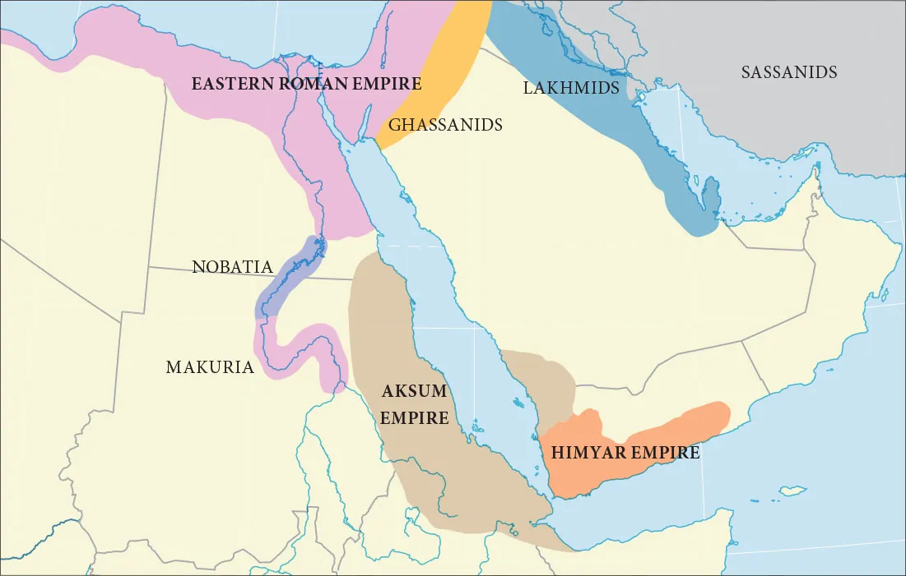
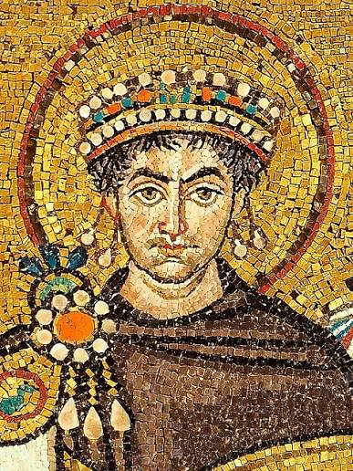

[previous](./5_Usurpation_of_the_Throne_of_Yemen.md)  <======> [next](./7_Abraha_rebel_against_mecca_and_humiliated.md)

# The one survivor

After that massacre in Najran, only one person survived. His name was Daws Dhu Thalaban (دَوْسٌ ذُو ثَعْلَبَانَ).
he escaped on his horse in the desert and could not be caught. He continued travelling until he reached Caesar, the emperor of Byzantium. Since the emperor was also a Christian, as he was, he told him what Dhu Nuwas and his troops had done and asked his aid. 

The emperor said that Daws’ land was very far, but that he would write a message to the king of Abyssinia who was also of the same religion and whose country was closer at hand. The emperor then wrote such a message asking him to provide help and to seek revenge for Daws.

*(image_source: [openstax](https://openstax.org/books/world-history-volume-1/pages/10-3-the-kingdoms-of-aksum-and-himyar))*

So Daws took Caesar’s letter to the Negus 10 who dispatched 70,000 troops from Abyssinia under the leadership of one of his officers named **Aryat**, along with another named Abraha al-Ashram. Aryat crossed over the sea and reached the shores of Yemen, accompanied by Daws. Dhu Nuwas came out to meet him with his forces made up from Himyar and the Yemeni tribes under his control. When they engaged, Dhu Nuwas and his men were defeated. When he realized that disaster had befallen himself and his people, Dhu Nuwas turned his horse to the sea and beat it until it entered the water and took him through the shallows and out to the depths of the sea where he perished. Aryat entered Yemen and took control there. 

## some background information:
Daws Dhu Tha‘laban lived during the early 6th century CE. The massacre at Najran and his subsequent flight occurred around 523 CE.  1. The 

### Byzantine Emperor (Caesar)Name: Justin I (reigned 518–527 CE). 

*(Justin 1 - [source](https://en.wikipedia.org/wiki/Justinian_I))*

**Context**: When Daws arrived in Constantinople seeking aid, Justin I was eager to help a fellow Christian population. However, because Constantinople was too far from Yemen to send a direct land army, Justin I wrote a formal decree to the King of Abyssinia (Axum), requesting him to mobilize forces and avenge the massacre.  2. The 

### Abyssinian King (The Negus)Name: King Kaleb (also known in Christian/Greek sources as St. Elesbaan or Ella Atsbeha).  
**Context**: He ruled the powerful Christian Kingdom of Aksum (in modern-day Ethiopia/Eritrea). Upon receiving the letter from Emperor Justin I via Daws Dhu Tha‘laban, Kaleb launched a massive naval and land invasion across the Red Sea in 525 CE, which successfully defeated Dhu Nuwas and brought an end to the Himyarite Kingdom.  (Note: This Negus, King Kaleb, is not the same Negus—Ashama ibn Abjar—who later granted protection to the Prophet Muhammad's companions during the First Hijrah in 615 CE). 

# How Abraha al-Ashram rebelled against, fought, and killed Aryat, and so assumed power over Yemen.

[Ibn Ishaq](./Islamic%20scholars/Ibn%20Ishaq%20(%20اِبْنُ%20إِسْحَاقَ).md) stated: “Aryat remained in control over Yemen for some years but eventually Abraha challenged him and the Abyssinian forces split into two sides. One side moved to attack the other, but when the armies approached for battle, Abraha sent a message to Aryat suggesting that he was wrong to pit the Abyssinians against one another to the ultimate damage of all, and that they should meet alone in battle, all forces then combining under the authority of the one victorious. To this Aryat responded with agreement.

“Abraha, a short, stocky man and a devout Christian, then went out to fight Aryat who was tall, handsome, powerfully built, and bore a javelin. Behind Abraha was a slave named 'Atwada protecting his rear. Aryat struck out, aiming at the top of Abraha’s head, but his javelin hit him on the forehead and slit his eyebrow, eye, nose, and lip; that was why he was known as *al-Ashram*, i.e. the *cleft-face*. Then 'Atwada advanced from behind Abraha and attacked and killed Aryat. The forces of Aryat went over to Abraha and all Abyssinians in Yemen united under him. Abraha then paid over the blood price for Aryat’s death.

“When this news reached the Negus (*The title given to the ruler of Abyssinia (now Ethiopia)*), who had dispatched them both to Yemen, he was furious at Abraha, for he had attacked and killed his commander without orders from himself. Then the Negus swore an oath that he would give Abraha no respite until he had trodden his land and cut off his locks. So Abraha shaved his head and filled a leather bag with Yemeni soil which he sent to the Negus with a message saying, 

> **‘O king, Aryat was merely your slave as I am. We differed about your command; everyone owes you obedience. But I was stronger, more effective, and more skilful than he was in managing Abyssinian affairs. I shaved my head completely when I heard of the king’s oath and have sent to him a bag of my country’s soil so that he may tread it underfoot and so keep his oath.**’ 

This message pleased the Negus when he received it, and he sent him a message that Abraha should remain in Yemen until further orders. And so it was that Abraha did remain in Yemen.”

One thing to understand is that Abrahah was decidedly **clement** *(mild, gentle, or merciful)* for a 6th-century military commander. He was ambitious, assertive, and determined to project power, but he preferred building alliances, repairing infrastructure, and showing calculated mercy over wanton violence.

[previous](./5_Usurpation_of_the_Throne_of_Yemen.md)  <======> [next](./7_Abraha_rebel_against_mecca_and_humiliated.md)

