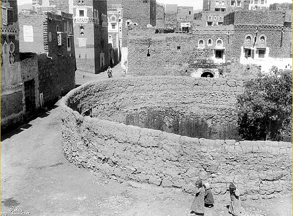
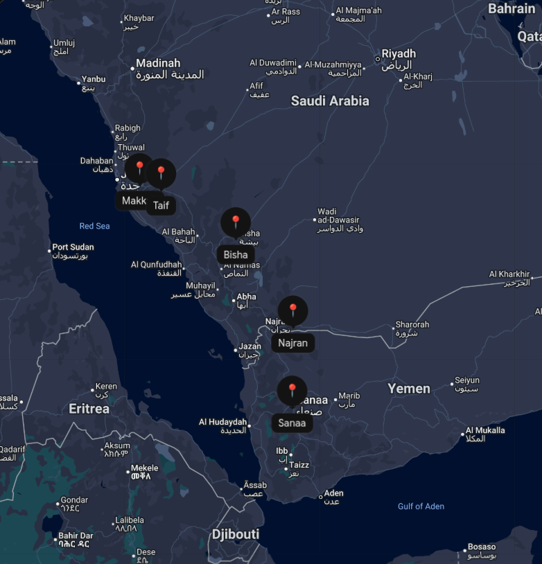
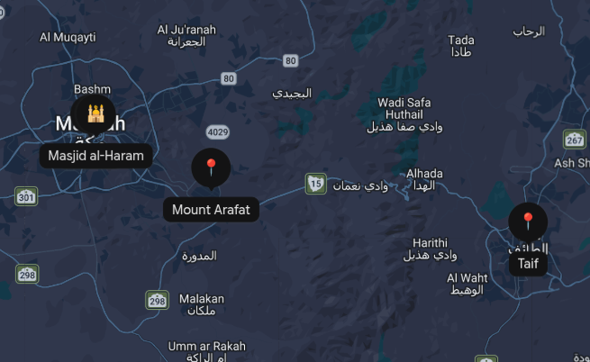
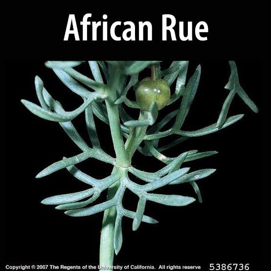
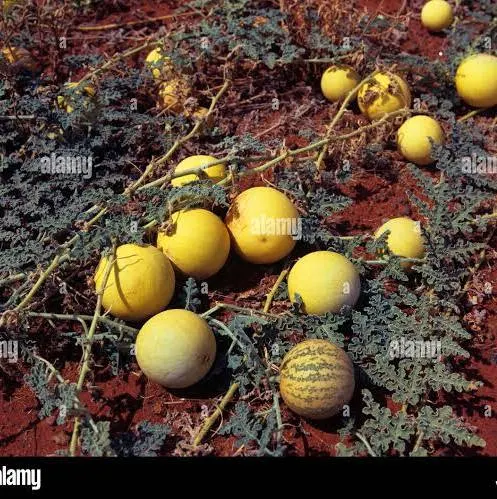
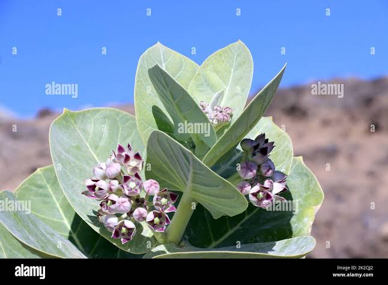
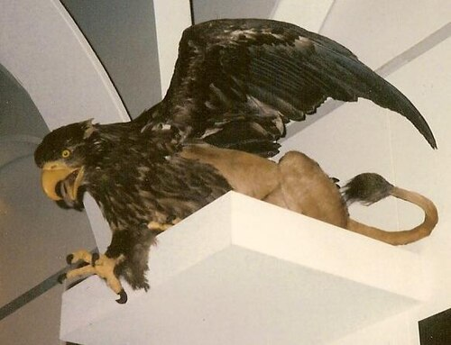

[previous](./6_Rule_passing_from_Himyar_to_Blacks.md)  <======> [next](./8_kingship_revert_to_himyar.md)

# Abraha builts the church " al-Qullays"

[Ibn Ishaq](./Islamic%20scholars/Ibn%20Ishaq%20(%20اِبْنُ%20إِسْحَاقَ).md) said that 
In Sana'a, Yemen, Abraha builds a church named **al-Qullays**. the like of which had never at that time been seen on earth before. He wrote to the Negus saying, "I built a church for you the like of which was never built for any king before you, and I will not cease striving until I divert to it the Arabs" pilgrimage. 

[Al-Suhayli](./Islamic%20scholars/Abū%20al-Qāsim%20al-Suhaylī%20(أَبُو%20الْقَاسِمِ%20السُّهَيْلِيُّ).md) stated that Abraha sought to humiliate the people of Yemen by building this ugly church, humbling them in a variety of ways. He invariably amputated the hand of any labourer who arrived for work after dawn. He began to transfer to it, from the **Balqis palace**, marble, stone, and splendid furnishings. In it he erected crosses of gold and silver and pulpits made of ivory and ebony. Al-Qullays was built very tall indeed and its spaciousness was amazing. When eventually Abraha died and the Abyssinians dispersed, spirits would inflict evil on anyone daring to take any of its building materials or furnishings. 

This was because the building was undertaken in the name of **two idols, Ku'ayb and his wife**. The height of each of these was 60 cubits. Consequently the Yemenis left the church alone. It remained just as it had been up till the time of al-Saffah, the first of the Abbasid caliphs. He sent there a group of men of determination, judgement, and knowledge who demolished it stone by stone; and today its remains are completely effaced.

## An intercalator became enraged and defecated in it.
When the Arabs learned of and talked about Abraha’s message to the Negus, a certain *intercalator* of the Kinana tribe became enraged (kinana is an adnani arab tribe from Mudar). 

(the intercalators were the ones who would postpone a sacred month in Mecca, during which warfare would have been forbidden, when they wanted to make war. This is referred to in the Quran: 
> ‘The practice of postponing (the sacred month) is merely further disbelief’  (surat al-Baraa, IX, v.37)).

“This Kinanite then travelled to the al-Qullays church and squatted down there, that is he defecated without anyone seeing, then left and returned home. When Abraha was informed of this he demanded to know who had done such a thing. He was told: ‘It was one of the people of that bayt (building) in Mecca to which the Arabs made pilgrimage. When he heard of what you said of your intention to change the Arabs’ pilgrimage to this church of yours, he became angry and so defiled it, thereby indicating that it was unworthy of being a place of pilgrimage.’

## Abraha gets angry and declares war aganist kaaba
Abraha was enraged at this and he swore that he would go to the ka'ba and destroy it. And so he ordered his Abyssinian troops to equip themselves and make ready, and then he set forth with his elephant. The Arabs were highly anxious and alarmed when they heard of this and considered it their duty to do battle with him, when they learned he wanted to destroy the ka'ba, God’s sacred edifice.

## First resistance at Sana by Dhu Nafr
Then what happened was that a member of the Yemeni nobility named **Dhu Nafr (ذُو نَفْرٍ)** . He was a prominent Yemeni chieftain (qayl) and landowner of Himyarite lineage who held significant authority in southern Arabia. He summoned his people and those Arabs who would support him to do battle with Abraha and prevent his destruction of the ka'ba. Some did respond and they engaged in battle. 

The battle between Dhu Nafr and Abrahah took place in southern Arabia, in the mountainous region between Sana'a (see below) and the northern highlands of Yemen as Abrahah's army first began its march out of Yemen toward the Hijaz. Dhu Nafr and his supporters were vanquished and he himself was taken prisoner and brought before Abraha. When about to be killed, Dhu Nafr suggested to Abraha that he might well be more useful to him alive than dead. So Abraha kept him prisoner, in chains; a proof that he was a clement person.

## Second resistance at Khathams by Nufayl
Abraha continued ahead to meet further adversaries. In the area where the people of Khatham tribe lives (modern day Bisha in the map above), Abraha has to fight against **Nufayl b. Habib al Khathami** with his two allied tribes of **Shahran and Nahis**, along with other Arab supporting tribes. They did battle, Abraha won, and took Nufayl prisoner. When Abraha was about to execute him, Nufayl pleaded for his life and offered to be his guide in the Arab territory, guaranteeing that the tribes under him would be obedient to Abraha (eventhough Nufayl was not loyal to Abrahah at heart). So Abraha released him and went on ahead, with Nufayl acting as guide.

## Abraha reaches Taif
Reaching Taif, Abraha was met by Masud b. Muattib b. Malik b. Ka'bb 'Amr b. Sa'd b. 'Awf b. Thaqif along with the warriors of Thaqif. They addressed Abraha, saying, ‘O king, we are your slaves, fully obedient to you; we have no dispute with you and this temple of ours is not the one you want.’ (By this they meant the temple devoted to their goddess al-Lat) (Astagfirullah) . The temple of al-Lat was one they had there in al-Taif that they venerated almost as was the ka'ba.  they said ‘What you want is the building in Mecca; we will send guides to take you there.’ So Abraha passed them by unmolested.”

So Thaqif sent with Abraha **Abu Righal** as guide to Mecca. They travelled as far as **al-Mughammis** (a place just on east of mt. Arafat in the map below) where they made a stop. It was there that Abu Righal died and thereafter the Arabs stoned his grave.

### small tangent about Abu Righal
*Before this one, there existed another Abu Righal from the story of [Thamud](./Types%20of%20arabs/Thamud(%20ثَمُودُ).md). Abu Righal was one of their men who would seek refuge at the sanctuary but was struck and killed by a stone as he left it. Once the Messenger of God (SAAS) said to his Companions, ‘And the proof is that he was buried with two branches of gold.’ When his grave was disinterred, they did find them. He was said to be known as Abu Thaqif.” The connection between these two account is that the name of this latter Abu Righal was the same as that of **his ancestor** and that the people stoned his grave just as they did that of the former. But God knows best.*

## Story after Abu Righal's death - Abraha's men and people of Tihama region.
When Abraha made a halt at al-Mughammis he sent on ahead to Mecca one of his Abyssinian men named al-Aswad b. Maqsud with some cavalry (the part of the army that fought on horses in the past). 

He brought to him the possessions of the people of Tihama (*Region*), i.e from Quraysh and others. This included 200 camels belonging to 'Abd al-Muttalib b. Hashim (Grand father of Prophet (SAW)) who was at that time the leader and elder of Quraysh. As a result, Quraysh, Kinana, and Hudhayl, and all those venerating the ka'ba decided to do battle with Abraha but abandoned this idea when they learned they had insufficient power to match him. (Note: Quraysh is a direct sub-branch of the larger Kinanah tribe.)

Abraha then sent **Hunata** the Himyarite to Mecca with the following order: “Find the leader and the most noble of these people. Then tell him that the king says, ‘I have not come to war upon you, but only to destroy that building (the ka'ba). If you do not engage in warfare to prevent our access to it, then I shall have no need for your blood.’ If he does not want war, bring him to me with you.”

When Hunata entered Mecca he asked after the leader of Quraysh. He was directed to 'Abd al-Muttalib b. Hashim and so passed on Abraha’s message to him. 'Abd al-Muttalib replied, “By God, we do not want war with him and have not the power for it. This house is God’s sacred house and that of His true follower Abraham, upon whom be peace.” He was saying in effect, “If God does protect it from Abraha, then it is because it is His holy sanctuary and His house. If he abandons it to him, then, by God, there’s no way for us to defend it.” Hunata then told 'Abd al-Muttalib that he must accompany him to Abraha in accord with his orders.

### Tangent about Abd al Muttalib
In Arabic, the word Muttalib (مُطَّلِب) means "the seeker," "the demander," or "the pursuer."

Al-Muttalib was a real human being, not an idol or a deity like Manat or Al-Lat.

The name "Abd al-Muttalib" does mean "servant of Al-Muttalib," but it was actually a misunderstanding and a nickname, not a religious title.

**The Real Name:** The grandfather of Prophet Muhammad (SAW) was originally named **Shayba**.

**The Long Journey:** Shayba grew up with his mother in Medina. When his uncle, Al-Muttalib, went to Medina to fetch him and bring him back to Mecca, the boy arrived looking dusty, travel-worn, and poorly dressed.

**The Misunderstanding:** As Al-Muttalib rode into Mecca with the young boy sitting behind him on his camel, the townspeople did not recognize the child. They assumed Al-Muttalib had just bought a new slave on his travels.

**The Nickname Stuck:** The people shouted, "Look! This is Abd al-Muttalib!" (meaning, "Look, it's the slave of Al-Muttalib!"). Even though Al-Muttalib corrected them and explained that the boy was his own nephew, the nickname stuck for the rest of his life.

## Abd al-Muttalib meets Abraha
So 'Abd al-Muttalib set off along with some of his sons. Arriving at Abraha’s encampment, (before meeting with Abraha) he asked to see Dhu Nafr (the first resistor), who was a friend of his. When he met Dhu Nafr, still in confinement, he asked him whether he had any solution to their predicament. Dhu Nafr replied, “How can a man have a solution when he is a king’s prisoner and is expecting to be killed at any time? I have no advice to give you, except to say that **Unays**, the elephant keeper, is a friend of mine. I will send him a message strongly commending you and ask him to seek permission for you to address the king. Speak to him as you see fit, and Unays will intercede on your behalf as well as he can.”

'Abd al-Muttalib agreed and Dhu Nafr sent Unays the following message: “'Abd al-Muttalib is lord of Quraysh and custodian of the well of Mecca *(The reference is to zamzam , the holy well in Mecca)*. he feeds both men in the plains and wild animals on the mountains. The king seized 200 of his camels. So seek permission for him to see the king and intercede for him as best you can.” Unays responded that he would. Unays then spoke to Abraha, saying, “O king, here at your door seeking audience is the lord of Quraysh and keeper of the well of Mecca; he feeds both men in the plains and the wild beasts in the mountains. Allow him in to see you to discuss a matter with you.” Abraha let him in.

'Abd al-Muttalib was the most dignified, handsome, and impressive of men. When Abraha saw him, he wanted to honour him by not making him sit below himself. But he did not want the Abyssinians to see him sitting next to himself on the throne. So Abraha descended, sat down on a carpet, and had 'Abd al-Muttalib take his place beside him. He then told his interpreter to ask why he had come and he did so. 'Abd al-Muttalib replied, “What I want is for the king to return the 200 camels he took from me as compensation.”

Hearing this, the king told his translator to reply as follows: “You impressed me when I saw you, but you displeased me when you spoke. You want to talk to me about 200 camels I took from you in compensation, but not about the building which is your religion and your ancestors’ religion that I have come to destroy? ”

'Abd al-Muttalib replied, “I am the owner of the camels; the building has its own master who will protect it.”

Abraha replied, “He won’t protect it from me.”

“Then it’s between you and Him,” 'Abd al-Muttalib said.

And so Abraha returned his camels to 'Abd al-Muttalib.

Ibn Ishaq stated that when he went in to see Abraha, 'Abd al-Muttalib was accompanied by **Ya'mur** b. Nafatha b. 'Adi b. al-Dil b. Bakr b. 'Abd Manat b. Kinana, **leader of Barm Bakr tribe**, and **Khuwaylid** b. Wa'ila, **leader of Hudhayl**.

These men offered Abraha one-third of the produce of Tihama if he would withdraw and not destroy the building. But Abraha refused their offer. And God alone knows whether or not that happened.

When they left Abraha, 'Abd al-Muttalib went to report to Quraysh and told them to retreat from Mecca to defensive positions in the mountains. Then 'Abd al-Muttalib took hold of the metal door knocker of the ka'ba and stood there with a group of men from Quraysh praying to God and asking His help against Abraha and his troops. As he stood holding the ka'ba door knocker, c Abd al-Muttalib recited the verses:
>
>“O God, Your worshippers protect their homes, so protect Your building.
>
>Let not their cross and their power vanquish Yours tomorrow
>
>If You should leave them free with our qibla, u then that is what You will.”
>
Ibn Hisham said that these were what he found to be the authentic verses of this poem.
Ibn Ishaq reported that 'Abd al-Muttalib then released the ka'ba door-knocker and went off, along with his men of Quraysh, to the mountain peaks, taking up defensive positions and waiting for whatever Abraha might do.

## Abraha prepared to enter Mecca
Next morning Abraha prepared to enter Mecca, readying his elephant and equipping his troops. The elephant’s name was **Mahmud**. When they directed the elephant towards Mecca, Nufayl b. Habib (the second resistor) came close to it, took its ear and told it, “Kneel down, then go back to where you came from. Here you are in God’s holy land.” Then he released the elephant’s ear and it knelt.

According to al-Suhayll this means that the elephant fell to the ground, since it is not in the nature of elephants to kneel; although it has been said that some elephants do kneel like camels. God knows best.

Nufayl b. Habib hurried off into the mountains. Abraha’s troops beat the elephant to make it stand up, struck its head with axes, and stuck hooks into its hide until it bled. But it refused to stand. Then they turned it to face towards Yemen, and it got up and moved in a hurry. When they directed it towards Syria and then towards the east it did the same. But when they turned it towards Mecca it knelt again.

## Allah sends against them the birds
Then Allah sent against them birds from the sea like swifts and crows, each one of which carried three stones, one in its beak and one in each claw. The stones were like chickpeas and lentils. Every soldier hit died, but not all were struck. So they retreated in haste along the road by which they had come, calling out for Nufayl b. Habib to lead them on the way back to Yemen. About this situation Nufayl spoke these verses:

>
>"Greetings to you from us, O Rudayna. How much we have gladdened our eyes this morning!
>
>Rudayna, had but you seen, but may you see not, what we saw at Mt. Muhassab.
>
>Then you would have forgiven and praised me, and not felt ill will at what passed between us.
>
>I praised God to see the birds, and feared that a stone be cast upon me.
>
>While all called out for Nufayl, as though I owed the Abyssinians some debt.”

Ibn Ishaq continued, “So down they scrambled by any path, dying randomly where they went. Abraha was struck on his body and they carried him away as his fingers dropped off one by one. As they fell pus and blood emerged. When they got him to San'a he was like a baby bird. He finally died when his heart burst from his chest. Or so they say.”

Ibn Ishaq went on to relate that [Ya'qub b.'Utba](./Islamic%20scholars/Ya‘qub%20ibn%20‘Utba%20(يعقوب%20بن%20عتبة%20بن%20المغيرة%20بن%20الأخنس%20الثقفي).md) told him that it was reported that measles and smallpox were seen for the first time in Arab lands that year. Also that that was the first year bitter plants were observed there: *the African rue, the colocynth, and the Asclepias gigantea.*

Ibn Ishaq commented that when God sent Muhammad (SAAS) one of the actions he enumerated as God’s grace and bounties upon Quraysh was His having repelled the Abyssinians and saved Quraysh for posterity. And so God spoke in the Qur’an, 
>
>(surat al-Fil, CV, v.1-5).
>
>“Have you not seen how God dealt with those who had elephants? 
>
>Did he not defeat their scheme, 
>
>sending flocks of birds 
>
>which cast upon them hard stones of baked clay, 
>
>rendering them like digested chaff?” 

## Opinions on ababil (those birds)
Many eariy authorities interpreted this word al-ababil to mean birds that follow one another hither and thither in groups.
According to Ibn 'Abbas they had beaks like those of birds but paws like those of dogs.
'Ikrima said that their heads were like those of lions which emerged at them from the sea and that these were green.
'Ubayd b. 'Umayr said that they were black sea-birds bearing stones in their beaks and claws.

According to Ibn 'Abbas they were similar in form to the griffins of North Africa. He also maintained that the smallest stones they had were like human heads, some as big as camels. That is what Yunus b. Bukayr said on the authority of Ibn Ishaq. It is also said they were small — but God knows best.

*(A reference of how Griffin looks like (not real one btw))*

## How the stones were dropped
Ibn Abi Hatim said that he was told that when God wished to destroy those with the elephant He sent upon them birds like swifts that were raised up from the sea. Each bird carried three stones, two in its claws and one in its beak. He said the birds came, lined up over their heads, screeched, and dropped what was in their claws and beaks. Each stone that fell on a man’s head exited through his behind and each stone that fell on one side of a man exited from the other. God also sent a fierce gale which struck the stones and increased their velocity. And so they were all killed.

But, as Ibn Ishaq has stated above, not all were struck by the stones. Some did return to Yemen to tell their people of the disaster that befell them. And it was also said that Abraha, God curse him, went back, his fingers dropping off one by one, and that when he reached Yemen his chest burst open and he died.

Ibn Ishaq related that mother 'A’isha (R.A) said, “I saw the elephant’s keeper and guide in Mecca, both blind and crippled, begging for food.” As mentioned above, the keeper’s name as discussed earlier was Unays, though no name was given for its guide. But God knows best.

Al-Naqqash stated in his Qur’an exegesis that a torrent bore away their bodies into the sea. Al-Suhayll said that the events of the elephant occurred on the first day of Muharram, year 886 of the era of Dhu al-Qarnayn (Alexander the Great).

And Ibn Kathir add that it was the same year that the Messenger of God (SAAS) was born, as is generally known. It is also said, however, that these events preceded his birth by some years, as we will report, God willing, and in Him we trust.

Ibn Ishaq mentions that poetry was recited by the Arabs on this great occasion on which God rendered His sacred house victorious, wishing it to be honoured, respected, purified, and dignified through the mission of Muhammad (SAAS) and through the true religion He legislated to him. One of the elements of this religion, indeed one of its pillars, is prayer, the direction of which would be towards this sanctified kaba. What God did then to the elephant’s army was not a victory for Quraysh over the Abyssinian Christians; the Abyssinians were at that time closer to it (i.e. to victory from God) than the polytheist Quraysh. The victory belonged to the sacred house and served to set the foundation and pave the way for the mission of Muhammad (SAAS).

## After the demise of Abraha
Ibn Ishaq and others related that upon the demise of Abraha, his son Yaksum assumed power, followed by his (Yaksum's) brother Masruq b. Abraha. He was the last of their kings and it was from him that Sayf b. Dhu Yazan of Himyar wrested the kingship with the aid of troops he brought from Chosroe Anushirwan (the persian king), as we shall relate. The events with the elephant occurred in the month of Muharram, in the year 886 in the era of Dhu al-Qarnayn, Alexander son of Phillip, the Macedonian, after whom the Greeks count their calendar.

Abraha and his two sons having died and Abyssinian rule over Yemen having ended, al-Qullays, the temple Abraha had built, in his ignorance and stupidity, as a substitute for the Arab pilgrimage, was abandoned and left unattended. 
Abraha had constructed over it two wooden idols, Ku'ayb and his wife, each one 60 cubits high. These idols were invested by spirits, and consequently anyone chancing to take anything from the temple building or its furnishings would come to harm. This continued to be the case until the time of al-Saffah, the first of the 'Abbasid caliphs. When he was told about it and all its marble and furnishings that Abraha had brought from the Balqls castle in Yemen, he sent people to disassemble it stone by stone and to take away all its contents. That is how al-Suhayll related it; God knows best.

### Small note: **Christian Iconography vs Idols:**
We might doubt how christian king Abraha built idols on church. but turns out that,
in Eastern Christian and Byzantine-influenced architecture of the 6th century, grand churches were routinely adorned with monumental sculpted figures, saints, biblical characters, and royal patrons. While early Muslim chroniclers labeled these figures as asnam (idols), to Abrahah and his Byzantine-trained architects, they were decorative Christian icons, statues of local converts/martyrs, or stylized royal effigies.

### How Sayf(Yemeni king after Abraha) and Dhu Nuwas (Yemeni king before Abraha) are related:

**Dhū Nuwās (Zur'ah ibn Tubbān As'ad)** belonged to the direct royal line of the Tubba' monarchs.

**Sayf ibn Dhī Yazan** belonged to the Dhū Yazan princely house (the lords of Hadramawt and southern Yemen), which was one of the foremost royal clans of Himyar.

# Summary
Abraha aims to build a church that he wants it to be better that Kaba. Hearing that, a person got enraged and defecated in it. So Abraha waged war against Kaba, he met his first resistor in Sana and captures him, the second resistor Nufayl at modern day Bisha and keeps him as guide, reaches al mugammis and captures some camels of Abd al muttalib. Abd al muttalib talks with Abraha and gets his camels and pray to God because he was helpless. Elephants refuse to come towards mecca but still they somehow brings and birds throw stones and Abraha dies at Sana in his return journey. Abraha's first son, then his next son rules, then sayf gets help from persia and establishes Yemeni power there.

[previous](./6_Rule_passing_from_Himyar_to_Blacks.md)  <======> [next](./8_kingship_revert_to_himyar.md)