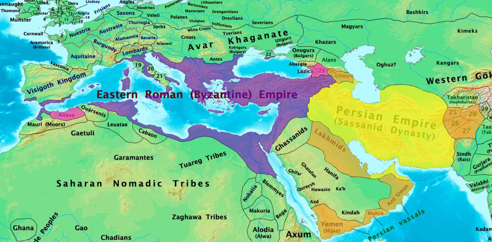
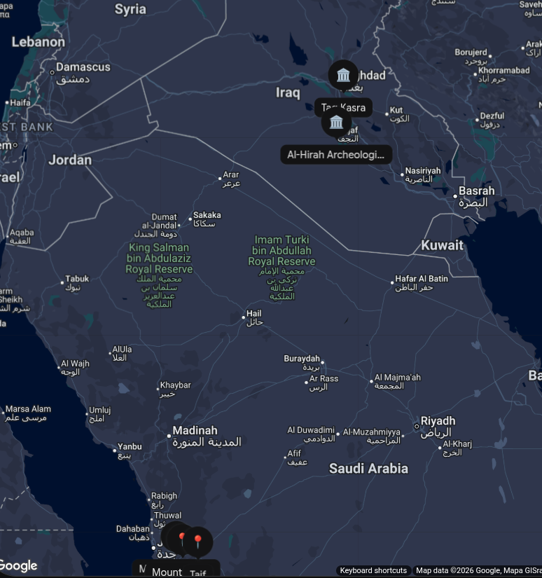
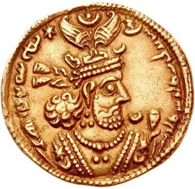
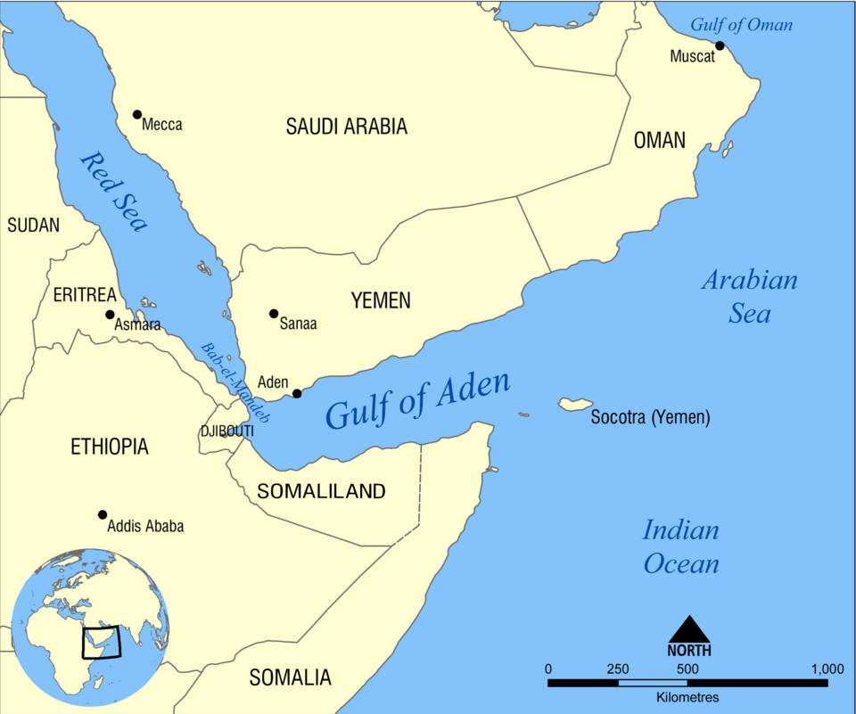

[previous](./7_Abraha_rebel_against_mecca_and_humiliated.md)  <======> [next](./9_satirun.md)

## After Abraha's death
After Abraha died, his son Yaksum b. Abraha became king over the Abyssinians. Then, when Yaksum died his brother Masruq b. Abraha became the Abyssinian king over Yemen. Ultimately, the people of Yemen having so long suffered in misery, Sayf b. Dhu Yazan, the Himyarite, became rebellious. *(This person is important later, because he says something about prophet's prophethood)*

# Sayf's journey
His genealogy was Sayf b. Dhu Yazan b. Dhu Asbah b. Malik b. Zayd b. Sahl b. 'Amr b. Qays b. Mu'awiya b. Jashm b. c Abd Shams b. Wa'il b. al-Ghawth b. Qutun b. 'Arlb b. Zuhayr b. Ayman b. al-Hamaysa' b. al-Aranjaj (i.e. Himyar) b. Saba'. Aranjaj is Himyar's birth name. Sayf was also known as Abu Murra.

## Sayf goes to Byzantine emperor
He made his way to the Byzantine emperor and complained to him of the state of affairs in Yemen, asking him to oust the Abyssinians and appoint him governor there.

He suggested the emperor to send from Byzantium whatever troops he thought necessary for this purpose and so himself would become king of Yemen. The emperor declined.

## Sayf goes to the Chosroe of Persian Empire

So Sayf went to al-Nu'man b. al-Mundhir, who was Chosroe’s vice-regent over al-Hlra and the neighbouring territories in Iraq *(Remember [Rabia b Nasr](./3_The_story_of_Rabia_Nasr.md#impact-on-rabia-and-info-about-al-numan-b-al-mundhir), in the end we have discussed about al-Nu'man b. al-Mundhir as from his progeny.)* Sayf complained to him about the Abyssinians. 

Al-Nu'man responded that every year he sent an official delegation to Chosroe, (in Taq kasra. look at the map above) and invited Sayf to stay with him until then. Sayf agreed.

(**A small side note:** *Do you see that the chosroe appointed an arab near al hira even though the main king's throne is not so far away ?(just 160 km). That is because of strategic reasons. Al hira is on border and with an arab king there, it can act as 1. A Buffer Against Bedouin Tribal Raids, 2. Proxy Warfare Against the Byzantine Empire(instead of direct persian war) 3. Arab Diplomacy, Lineage, and Governance and finally 4. Securing Lucrative Caravan Trade Routes. Fatal mistake of the chosroe was that When Chosroe (Khosrow II) had a personal falling out with al-Nu‘mān III in 602 CE, he had him executed, dissolved the Lakhmid dynasty, and placed a direct Persian governor in Al-Ḥīrah.  This removed the Arab shield that had protected Mesopotamia for three centuries. Without the Lakhmids managing the frontier, the Sasanian borders were left completely exposed, leading directly to the Arab victory over the Persians at the Battle of Dhū Qār just a few years later.*) 

continuing the story, Sayf later did accompany al-Nu'man, who took him in to see Chosroe, seated in the chamber where his crown was kept. His crown was like a large grain bucket and was, so they say, set with rubies, chrysolites, pearls, gold, and silver, suspended by a gold chain from the dome of his audience chamber. His neck did not bear the crown; he was kept hidden by a cloth until he sat down there. Then he would put his head into his crown. When he was thus positioned on his throne, the cloth would be removed. All who saw him for the first time would kneel down in awe of him.

(Gold dinar of Khosroe II. source: [world history encyclopedia](https://www.worldhistory.org/Khosrow_II/))

When Sayf entered he bowed his head down low, and the king commented, “It is really stupid to come in through such a tall doorway and bow one’s head down so low! ” *(look at his arrogance. See how this is going to end him (so much later. not just now))*

When this remark was transmitted to Sayf, he responded that he had only done this out of his preoccupying distress that overwhelmed all else. He then went on to say, “O king, crows have taken charge of our country! ”. 

“What crows?” Chosroe asked, “the ones from Abyssinia or from Sind?”. *(Sind means Indus Valley region in northwestern ancient India (located in modern-day southern Pakistan, centered along the lower Indus River). A proof that real Indians were Black)* 

"From Abyssinia. I’ve come to ask your help. and you shall have kingship over all our land.”. 

Chosroe replied, “Your country is far away, and its riches meagre. I’m not going to embroil an army from Persia in Arabia. I don’t need that.”. 

He then presented Sayf with 10,000 pure-minted dirhams and a robe of honour. Having received these, Sayf went outside and began distributing the money to people. When the emperor heard of this he wondered why, and so sent for him and asked him why he was throwing away a king’s gift to people.

Sayf replied, “What else am I to do with your gift? Are not the mountains of my country made of gold and silver? ”

He said this to arouse Chosroe’s interest. So Chosroe then assembled his advisers and asked their counsel about Sayf and his mission. They reminded him of the presence in his gaols of prisoners he had condemned to death and suggested he send them with Sayf. For if they were killed that was what Chosroe had intended for them anyway, and if they triumphed his own domain would be expanded.

## Sayf returns to Yemen with forces under the commander named Wahriz.
Chosroe therefore sent off with Sayf eight hundred men from his prisons and placed them under the command of a man named Wahriz, an elder of the highest repute and ancestry. They set sail in eight ships, of which two sank; so six ships eventually arrived on the coast of Aden.

(source: [Wikimedia commons](https://commons.wikimedia.org/wiki/File:Gulf_of_Aden_map.png))

### Battle with Masruq b Abraha
Sayf gathered together all his own men he could to help Wahriz, saying, “My leg is with yours till we all die or all triumph.” Wahriz replied that that was fair.

Masruq b. Abraha then came out with his troops to meet them in battle. Wahriz sent his own son out to do combat and test their mettle. Wahriz’s son was slain; this increased the anger and hatred the father had for them.

When the enemy troops were positioned on the battlefield, Wahriz asked his men to indicate which was their king. They pointed to a man on an elephant with a crown and wearing a ruby between his eyes. He saw him and told them not to attack him.

For some time nothing was done. Then Wahriz asked what the Abyssinian leader was doing now. They told him he was now on a horse. Again Wahriz told them not to attack him, and for long they waited. Eventually Wa hr iz asked after the king and was told he was now on a mule. “So”, Wahriz commented, “on an ass’s filly, is he? He has humbled himself and his domain. I’ll take a shot at him. If you see his companions not moving, then stay still till I give you further orders, for I will have missed the man. But if you see his people crowding around him and not advancing, I shall have hit him. In that case, you advance at them.”

With that he braced his bowstring; they say his bow was so stiff only he could brace it *(Odysseus who??)*. He then had his eyebrows tied back and let the arrow fly. He split the ruby between the king’s eyes and the arrow pierced right through his head and emerged from its back. He was knocked off his mount, and the Abyssinians milled around him in confusion. The Persians charged and the Abyssinians were defeated, being killed or fleeing in all directions.

Wahriz advanced to enter San'a . When he reached its gateway he insisted that his banner could never enter in a lowered position, and that they should therefore demolish the gate. This was done and he went inside with his banner held high. 

## Sayf becomes the king

Arabs from Hijaz and elsewhere came in delegations to Sayf, praising him and congratulating him that the kingship had gone to him. Quraysh sent such a delegation and its number included 'Abd al-Muttalib b. Hashim. **Sayf gave him the glad tidings of the coming of the Messenger of God (SAAS) and informed him of what he knew about him**. Details of this will be given hereafter in the chapter related to the predictions of his coming.

## Shiqq and Satih prediction coming true

According to [Ibn Hisham](./Islamic%20scholars/Ibn%20Hishām%20(اِبْنُ%20هِشَامٍ).md) this is what Satih meant when he said, 

“Iram Dhu Yazan will follow, emerging from Aden to fight them, and he will leave not one of them in Yemen.” 

This is also what Shiqq meant by saying, 

“a young man, guilt-free and faultless, who will emerge from the fine of Dhu Yazan.”

The rule of the Abyssinians in Yemen, lasting between Aryat’s arrival and the death of Masruq b. Abraha at the hands of the Persians and the removal of the Abyssinians, was 72 years. Their dominion was passed through four rulers, Aryat, then Abraha, then Yaksum b. Abraha, and finally Masruq b. Abraha.

Ibn Ishaq’s account states, “So Wahriz and the Persians stayed in Yemen. And the *abna* (who live in Yemen today are descendants of these Persian troops.)”

### Explanation of the last line (not from the book)
Sayf ibn Dhī Yazan became the king of Yemen, while Wahrīz served as the Sasanian military governor/commander before returning to Persia.

1. How the Power Was Divided
- **The Royal Crown to Sayf:** Following the defeat and death of Masrūq (shot with an arrow by Wahrīz), Wahrīz entered Ṣan‘ā’ and formally installed Sayf ibn Dhī Yazan on the throne of his Himyarite ancestors.

- **Tribute to Persia:** Sayf ruled as a client monarch (malik), agreeing to pay regular taxes and tribute (kharāj) to the Sasanian Emperor, Khosrow I.

- T**he Arab Congratulatory Delegations:** Because Sayf was an indigenous Arab king restoring the native crown, Arab delegations arrived from all over the peninsula to Ṣan‘ā’ to pay homage—including the famous Qurayshi delegation led by ‘Abd al-Muṭṭalib.

2. Wahrīz's Departure and Later Return
- **Initial Departure:** Once Sayf was securely on the throne, Wahrīz left a small Persian military garrison behind and returned to Ctesiphon with the captured spoils of war for Chosroes.

- **The Assassination of Sayf:** Sayf kept a personal bodyguard of Abyssinian servants. While out on a royal excursion, these Abyssinian guards turned on him and assassinated him with spears.

- **Direct Persian Rule:** Following Sayf's death, chosroe I sent Wahrīz back to Yemen with a second Persian army to suppress the remaining Abyssinian resistance. From that point on, the indigenous Himyarite monarchy ended, and Wahrīz became the first direct Persian governor (marzbān) of Yemen. The Persian descendants settled there and became known in Arab history as the Abnā’ (الأبناء).

### How Persian Rule ended in Yemen
[Ibn Hisham](./Islamic%20scholars/Ibn%20Hishām%20(اِبْنُ%20هِشَامٍ).md)'s account states that eventually Wahriz died and Chosroe appointed his son al-Marzuban b. Wahriz (المَرْزُبَان بن وَهْرِز) over Yemen.  when he died, Chosroe appointed al-Marzuban’s son al-Taynujan(التَّيْنُجَان). Later Chosroe exiled al-Taynujan from Yemen because he was becoming corrupt and appointed a loyal one, Badhan (بَاذَان) to the rule; it was during his reign that the Messenger of God (SAAS) was appointed to his mission.

Two different Sasanian emperors ruled during this timeline:

- For the initial appointments (Wahrīz (وَهْرِز) and his son): The Emperor was Khosrow I Anushirvan (كسرى أنوشروان), who reigned until 579 CE.

- For the deposition/exile of al-Taynūjān and the appointment of Bādhān: The Emperor was his grandson, Khosrow II Abrawiz b. Hurmuz b. Anushirwan or simply Parvez (كسرى أبرويز), who reigned c. 590–628 CE. Khosrow II was the contemporary ruler when the Prophet Muhammad began his mission.

### Two different narrations on how this Chosroe II died
Two narrations on death of  Abrawiz who was the contemporary chosroe during prophet (SAW)

#### Ibn Hisham's account
[Ibn Hisham](./Islamic%20scholars/Ibn%20Hishām%20(اِبْنُ%20هِشَامٍ).md) relates on the authority of [al zuhri](./Islamic%20scholars/Al-Zuhrī%20(ابن%20شهاب%20الزهري).md) that Chosroe wrote the following to Badhan, “I am told that a man from Quraysh has appeared in Mecca claiming to be a prophet. Travel to him and seek his repentance. If he repents, well and good. If he does not, send me his head! ”

Badhan sent Chosroe’s message to the Messenger of God (SAAS) who replied, “God has promised me that Chosroe will be killed on such and such a day and month.” When this response was brought to Badhan he came to a halt and waited, saying, “If indeed he be a Prophet, it will occur as he said.” And God did kill Chosroe on the day foreseen by the Messenger of God (SAAS).

According to Ibn Hisham he died at the hands of his son Shirawayh. b. Abrawiz Others state that his sons joined forces to kill him.This Chosroe was by name Abrawlz b. Hurmuz b. Anushirwan b. Qabbadh. It was he who defeated the Byzantines, as referred to in the Almighty’s words in the Qur’an, 

>(surat al-Rum , XXX, v.1-3)
>
>A.L.M. The Romans have been defeated in the closest land” .
>

#### Al suhayli's account
According to [al-Suhayli](./Islamic%20scholars/Abū%20al-Qāsim%20al-Suhaylī%20(أَبُو%20الْقَاسِمِ%20السُّهَيْلِيُّ).md), his death occurred the night of Tuesday, the tenth of Jumada al-Ula, of the year 9 AH. What happened, it is thought, though God alone knows, is that when the Messenger of God (SAAS) wrote to Chosroe inviting him to accept Islam, he became enraged, tore up the letter and then wrote his own instructions to his governor in Yemen.

Some accounts report that the Messenger of God (SAAS) replied to Badhan’s emissary with the words, “This night my Lord has killed your lord.” And it was as he said, Chosroe being killed that very same night by his sons as a result of his having changed from justice to tyranny. Having deposed him they appointed his son Shlrawayh in his place. But he only lived on for six months or less after he had murdered his father.

#### Continuation
Al-Zuhri added that when news of Chosroe’s death reached Badhan, he sent word to the Messenger of God (SAAS) of the acceptance of Islam by himself and the Persians along with him. His Persian envoys asked, “To whom do we belong, Messenger of God?” He replied, “You are from us and to us, the people of the House.” According to al-Zuhrl, that was why the Messenger of God (SAAS) spoke the words, “Salman is of us, the people of the House.”

It seems that this was after the emigration of the Messenger of God (SAAS) to Medina. He therefore sent his commanders to Yemen to inform people of what was good and to call upon them to believe in God, the Almighty and Glorious. First he dispatched [Khalid b. al-Walld](./Sahaba/Khālid%20ibn%20al-Walīd%20(خالد%20بن%20الوليد).md) and  [Ali b. Abu Talib](./Sahaba/‘Alī%20ibn%20Abī%20Ṭālib%20(علي%20بن%20أبي%20طالب).md). later [Abu Musa al-Ash'ari](./Sahaba/Abū%20Mūsā%20al-Ash‘arī%20(أبو%20موسى%20الأشعري).md) and [Mu'adh b. Jabal](./Sahaba/Mu‘ādh%20ibn%20Jabal%20(معاذ%20بن%20جبل).md) followed them, and Yemen and its people accepted Islam.

Badhan died and his son Shahr b. Badhan ruled after him. It was he whom al-Aswad al- c Ansi killed after al-Aswad had pretended prophecy and taken Shahr’s wife, as we will report, and expelled from Yemen the deputies of the Messenger of God (SAAS). When al-Aswad was killed the authority of Islam returned.

[previous](./7_Abraha_rebel_against_mecca_and_humiliated.md)  <======> [next](./9_satirun.md)

