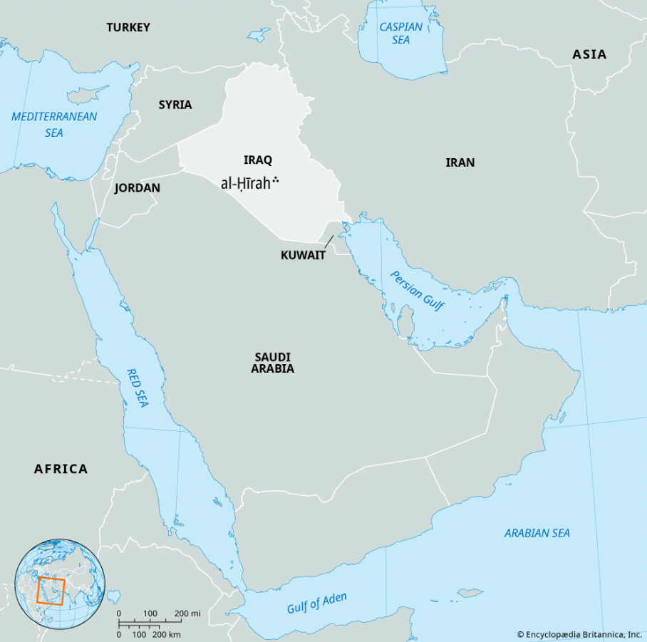

previous : [previous](2_The_story_of_Saba.md)

There was a person whose name was Rabi'a b. Nasr b. Abi Haritha b. 'Amr b. Amir (ربيعة بن نصر بن أبي حارثة بن عمرو بن عامر).
He was one of the Tubba kings in Yemen (for Himyar) and interestingly, he is from the lakhm tribe which has already left Yemen before the al-'arim torrent.

The main highlight of his story is his dream and his conversation with two mysterious soothsayers: Shiqq and Satih.

First let me tell you about these two people Shiqq and Sathi.

Satih name is given as Rabī‘ b. Rabī‘a b. Mas‘ūd b. Māzin b. Dhi’b b. ‘Adī b. Māzin Ghassān (رَبِيعُ بْنُ رَبِيعَةَ بْنِ مَسْعُودٍ بْنِ مَازِنِ بْنِ ذِئْبِ بْنِ عَدِيِّ بْنِ مَازِنِ غَسَّانَ) 

and his nick name is actually, Satiḥ al-Kāhin (سَطِيحٌ الْكَاهِنُ) 
kahin means sooth sayer in ancient arabia.
Kahins are those mysterious people who act and look mysteriously and give news about the future. whether it is a jinn posession or something else, After Prophet (SAW), all of these are considered shirk because this is not compatible with our beautiful religion Islam.

This person Satih had no limbs and was like a water skin (look at the image below) with his face in his chest. When he got angry he would puff up and sit.

Shiqq' name is given as Shiqq b. Sa‘b b. Yashkur b. Ruhm b. Afrak b. Qays b. ‘Abqar b. Anmār b. Nizār (شِقُّ بْنُ صَعْبِ بْنِ يَشْكُرَ بْنِ رُهْمِ بْنِ أَفْرَكَ بْنِ قَيْسِ بْنِ عَبْقَرِ بْنِ أَنْمَارِ بْنِ نِزَارٍ).

He looks like a half a man, like probably with one hand, one leg and so on.
And it is said that [Khālid b. ‘Abd Allāh al-Qasri (خَالِدُ بْنُ عَبْدِ اللَّهِ الْقَسْرِيُّ)](./Islamic%20scholars/Khālid%20b.%20‘Abd%20Allāh%20al-Qasri%20(خَالِدُ%20بْنُ%20عَبْدِ%20اللَّهِ%20الْقَسْرِيُّ).md) was of his progeny.

According to al-Suhayli both Shiqq and Satih were bom on the same day when Tarifa, daughter of al-Khayr, the Himyarite woman, died. It is said that she spat into the mouth of each of them, each therefore inheriting the gift of divination from her. She was the wife of 'Amr b.  'Amir, previously mentioned. But God knows best.

[Ibn Ishaq ( اِبْنُ إِسْحَاقَ)](./Islamic%20scholars/Ibn%20Ishaq%20(%20اِبْنُ%20إِسْحَاقَ).md) said that Rabi'a b. Nasr was king of Yemen and of the true line of the tubba- kings. He saw a vision that awed and terrified him. So he gathered every single soothsayer, magician, bird prognosticator, and star foreteller in his kingdom and told them, “I have seen visions that amazed and scared me. Tell me what they were and how to interpret them.” They replied, “Relate them to us and we will interpret them.” He responded, “If I do tell you what they were I won’t feel secure with your explanation; the only one capable of interpreting them will be someone who knows what they were before I tell them.”

One of the wise men then suggested, “If that is what the king wants, then he should send for Shiqq and Satih. No one is more knowledgeable than they; they will tell him what he asked for.”

So the king sent for them, and Satih (the water skin looking Kahin) arrived before Shiqq (the half a man). 
(note that, whenever a Kahin speaks, it is so mysterious and rhyming. This way of talking is called as Saj' al-Kuhhān. rhymed prose used by soothsayers, which is characterized by short, rhythmic, and cryptic phrases.)

Their conversation went as follows:

**The king**: “I have seen visions that amazed and scared me; tell me what they were, and if you are right you will interpret them correctly.”

then Satih says (in saj):  “I will do so.

رَأَيْتُ حُمَمَةً,
خَرَجَتْ مِنْ ظُلْمَةٍ،
فَوَقَعَتْ بِأَرْضِ تُهَمَةٍ،
فَأَكَلَتْ مِنْهَا كُلَّ ذَاتِ جُمْجُمَةٍ
**Ra’aytu humamah, (You saw fire emerge)
kharajat min zulmah, (from the darkness,)
fawaqa‘at bi’ardi tuhamah, (fall on low ground)
fa’akalat minhā kulla dhāti jumjumah. (consume every living being with a skull.)**

**The king**: “You’ve not made a single error, Satih. So how do you interpret them?”

Satih: 
أَحْلِفُ بِمَا بَيْنَ الْحَرَّتَيْنِ مِنْ حَنَشٍ،
لَيَهْبِطَنَّ أَرْضَكُمُ الْحَبَشُ،
فَلَيَمْلِكُنَّ مَا بَيْنَ أَبْيَنَ إلَى جَرَشَ

**“Aḥlifu bimā bayna al-ḥarratayni min ḥanash (I swear by all the snakes between the two stony plains,),** 
**layahbiṭanna arḍakumu al-Ḥabash, (that the Abyssinians will descend upon your land)** 
**falayamlikunna mā bayna Abyana ilā Jarash.”( and will surely reign over all between Abyan and Jurash)**

|**Arabic Word**|**Transliteration**|**Meaning**|
|---|---|---|
|**حَنَشٍ**|**Ḥanash**|Snakes/Serpents|
|**الْحَبَشُ**|**al-Ḥabash**|The Abyssinians|
|**جَرَشَ**|**Jarash**|Jarash (The territory)|

**The king**: “That, Satih, angers and hurts me greatly; will that occur in my time or later?”

Satih: 
بَلْ بَعْدَ حِينٍ،
بَعْدَ سِتِّينَ أَوْ سَبْعِينَ،
تَمْضِي مِنَ السِّنِينِ،

“Bal ba‘da ḥīn, (Nay, it shall be after a time)
ba‘da sittīna aw sab‘īn, (After sixty or seventy)
tamḍī mina-s-sinīn, (Years have passed away)

**The king**: “And will their dominion endure or be cut short? ”
Satih: 
ثُمَّ يُقْتَلُونَ أَجْمَعِينَ،
وَيَخْرُجُونَ مِنْهَا هَارِبِينَ

thumma yuqtalūna ajma‘īn, (Then they shall all be slain)
wa yakhrujūna minhā hāribīn.” ("And from it (the land), they shall emerge as fugitives in flight.)

**The king**: “Who will then follow, after their killing and expulsion? ”
Satih: 
**يَلِيهِ إرَمُ ذِي يَزَنْ** 
**يَخْرُجُ عَلَيْهِمْ مِنْ عَدَنْ** 
**فَلَا يَتْرُكُ مِنْهُمْ أَحَدًا بِالْيَمَنِ**  "

(Yalīhi Iramu Dhī Yazan)_"There shall follow him  Iram Dhu Yazan,"
(Yakhruju ‘alayhim min ‘Adan) "Emerging against them from Aden,"
(Falā yatruku minhum aḥadan bil-Yaman)"And he shall not leave a single one of them in Yemen.

The king: “And will his era endure or be cut short?”

Satih:

**بَلْ يَنْقَطِعُ وَيَزُولُ**

_(Bal yanqaṭi‘u wa yazūl)_ “Nay, it shall be cut short and pass away.”

The king: “Who will do this?”

Satih:

**نَبِيٌّ زَكِيٌّ، يَأْتِيهِ الْوَحْيُ مِنَ الْعَلِيِّ**

_(Nabiyyun zakiyy, ya’tīhi al-waḥyu min al-‘Aliyy)_ “A prophet, pure, to whom revelation comes from the All-high.”

The king: “And from where will this prophet come?”

Satih:

**مِنْ وُلْدِ غَالِبِ بْنِ فِهْرِ بْنِ مَالِكِ بْنِ النَّضْرِ، وَيَكُونُ الْمُلْكُ فِي قَوْمِهِ إلَى آخِرِ الدَّهْرِ**

_(Min wuldi Ghālib b. Fihr b. Mālik b. al-Naḍr, wa yakūnu al-mulku fī qawmihi ilā ākhiri al-dahr)_

“He will descend from Ghalib b. Fihr b. Malik b. al-Nadr. And the rule will be with his people till the end of time.”

The king: “Does time end?”

Satih:

**نَعَمْ، يَوْمَ يُجْمَعُ فِيهِ الْأَوَّلُونَ وَالْآخِرُونَ، يَسْعَدُ فِيهِ الْمُحْسِنُونَ، وَيَشْقَى فِيهِ الْمُسِيئُونَ**

_(Na‘am, yawma yujma‘u fīhi al-awwalūna wal-ākhirūn, yas‘adu fīhi al-muḥsinūn, wa yashqā fīhi al-musī’ūn)_

“Yes, on that day when the first and the last shall all be assembled, the good will be happy, and the evil will be mortified.”

The king: “Is this really true, what you’re telling me?”

Satih:

**نَعَمْ، وَالشَّفَقِ وَالْغَسَقِ، وَالْفَجْرِ إذَا اتَّسَقَ، إنَّ مَا أَنْبَأْتُكَ بِهِ لَحَقٌّ**

_(Na‘am, wal-shafaqi wal-ghasaq, wal-fajri idhā ittasaq, inna mā anbā’tuka bihi la-ḥaqq)_

“Yes, by the twilight, the dark of night, and the spreading dawn, what I told you really is the truth.”

|**Arabic Word**|**Transliteration**|**Meaning**|
|---|---|---|
|**زَكِيٌّ**|**Zakiyy**|Pure / Blameless|
|**الْعَلِيِّ**|**Al-‘Aliyy**|The All-High (God)|
|**الدَّهْرِ**|**Al-Dahr**|Time / Eternity|
|**الْمُحْسِنُونَ**|**Al-Muḥsinūn**|The Doers of Good|
|**الْمُسِيئُونَ**|**Al-Musī’ūn**|The Doers of Evil / Wrongdoers|
|**لَحَقٌّ**|**La-ḥaqq**|Is certainly the Truth|

## Arrival of Shiqq (one half a man)
Then Shiqq arrived and the king spoke to him as he had to Satih but hid from him what he had foreseen to establish whether they would be in agreement or not. 

The king: “I have seen visions that amazed and scared me; tell me what they were.”

Shiqq:

**رَأَيْتُ حُمَمَهْ، خَرَجَتْ مِنْ ظُلْمَهْ، فَوَقَعَتْ بَيْنَ رَوْضَةٍ وَأَكَمَهْ، فَأَكَلَتْ مِنْهَا كُلَّ ذَاتِ نَسَمَهْ**

_(Ra’aytu ḥumamah, kharajat min ẓulmah, fawaqa‘at bayna rawḍatin wa akamah, fa-akalat minhā kulla dhāti nasamah)_

“You saw fire emerge from the dark, fall down between a meadow and a hillock, and eat up every breathing creature there.”

The king: “You have it right. So how do you interpret it?”

Shiqq:

**أَحْلِفُ بِمَا بَيْنَ الْحَرَّتَيْنِ مِنْ إنْسٍ، لَيَنْزِلَنَّ أَرْضَكُمُ السُّودَانُ، فَلَيَغْلِبُنَّ عَلَى كُلِّ طِفْلٍ بَنَانٍ، وَلَيَمْلِكُنَّ مَا بَيْنَ أَبْيَنَ إلَى نَجْرَانَ**

_(Aḥlifu bimā bayna al-ḥarratayni min ins, layanzilanna arḍakumu al-Sūdān, falayaghlibunna ‘alā kulli ṭiflin banān, wa layamlikunna mā bayna Abyana ilā Najrān)_

“I swear by all the men who live between two stony plains that the blacks will descend upon your land, oppress all your young, and reign over all between Abyan and Najran.”

The king: “By your father, Shiqq, that angers and hurts me greatly; will that occur during or after my reign?”

Shiqq:

**بَلْ بَعْدَ حِينٍ مِنَ الزَّمَانِ، ثُمَّ يَسْتَنْقِذُكُمْ مِنْهُمْ عَظِيمٌ ذُو شَانٍ، وَيُذِيقُهُمْ أَشَدَّ الْهَوَانِ**

_(Bal ba‘da ḥīnin mina-z-zamān, thumma yastanqidhukum minhum ‘aẓīmun dhū shān, wa yudhīquhum ashadda-l-hawān)_

“No, it will be in a later period. And then a great man will emerge to save your people and inflict on your enemies all disgrace.”

The king: “And who will this great saviour be?”

Shiqq:

**غُلَامٌ لَا دَنِسٌ وَلَا خَامِلٌ، يَخْرُجُ مِنْ بَيْتِ ذِي يَزَنَ فَلَا يُبْقِي بِالْيَمَنِ مِنْهُمْ أَحَدًا**

_(Ghulāmun lā danisun walā khāmil, yakhruju min bayti Dhī Yazan falā yubqī bil-Yamani minhum aḥadan)_

“A young man who is guilt-free and faultless and will emerge from the line of Dhu Yazan.”

The king: “And will his reign last long?”

Shiqq:

**بَلْ يَنْقَطِعُ بِرَسُولٍ مُرْسَلٍ، يَأْتِي بِالْحَقِّ وَالْعَدْلِ، بَيْنَ أَهْلِ الدِّينِ وَالْفَضْلِ، يَكُونُ الْمُلْكُ فِي قَوْمِهِ إلَى يَوْمِ الْفَصْلِ**

_(Bal yanqaṭi‘u bi-rasūlin mursal, ya’tī bil-ḥaqqi wal-‘adl, bayna ahli-d-dīni wal-faḍl, yakūnu al-mulku fī qawmihi ilā yawmi-l-faṣl)_

“No, it will be brought short by a messenger dispatched, who will bring truth and justice, and come from a people of religion and virtue in whom power shall reside until the Day of Separation.”

The king: “What is the Day of Separation?”

Shiqq:

**يَوْمٌ تُجْزَى فِيهِ الْوِلَاةُ، وَيُدْعَى فِيهِ مِنَ السَّمَاءِ بِأَصْوَاتٍ، يَسْمَعُهَا الْأَحْيَاءُ وَالْأَمْوَاتُ، وَيُجْمَعُ فِيهِ النَّاسُ لِلْمِيقَاتِ**

_(Yawmun tujzā fīhi al-wilāh, wa yud‘ā fīhi mina-s-samā’i bi-aṣwāt, yasma‘uhā al-aḥyā’u wal-amwāt, wa yujma‘u fīhi al-nāsu lil-mīqāt)_

“A day when rulers shall be rewarded, when calls shall be made from the heavens that the living and the dead shall hear, and men shall be gathered to the appointed place.”

The king: “Is it really true what you predict?”

Shiqq:

**نَعَمْ، وَرَبِّ السَّمَاءِ وَالْأَرْضِ، وَمَا بَيْنَهُمَا مِنْ رَفْعٍ وَخَفْضٍ، إنَّ مَا أَنْبَأْتُكَ بِهِ لَحَقٌّ لَا كَذِبَ فِيهِ**

_(Na‘am, wa rabbi-s-samā’i wal-arḍ, wa mā baynahumā min raf‘in wa khafḍ, inna mā anbā’tuka bihi la-ḥaqqun lā kadhiba fīh)_

“Yes, by the Lord of the heavens and the earth and of all high and low between them both, what I have informed you is all true and doubt-free.”

|**Arabic Word**|**Transliteration**|**Meaning**|
|---|---|---|
|**نَسَمَهْ**|**Nasamah**|Breathing creature / Soul|
|**رَوْضَةٍ**|**Rawḍah**|Meadow / Green garden|
|**أَكَمَهْ**|**Akamah**|Hillock / Mound|
|**يَوْمُ الْفَصْلِ**|**Yawm al-Faṣl**|The Day of Separation/Judgment|
|**لَحَقٌّ**|**La-ḥaqq**|Certainly the Truth|

## Impact on Rabia and info about Al-Nu'man b. al-Mundhir

Ibn Ishaq stated that the soothsayers’ prediction had a great impact on **Rabi'a b. Nasr**, who subsequently provisioned all his family and relatives for departure to Iraq. He wrote on their behalf to a Persian king called **Shapur b. Hurmuz** (Sabur b. Khurzadh), who settled them in **al-Hira**.

According to Ibn Ishaq, the progeny of Rabi'a b. Nasr included **al-Nu'man b. al-Mundhir**, specifically:

 _Al-Nu'man b. al-Mundhir b. al-Nu'man b. al-Mundhir b. 'Amr b. 'Adi b. Rabi'a b. Nasr._

This al-Nu'man served as the viceroy over al-Hira for the Persian kings; the Arabs regularly sent delegations to him and offered him praise. This is the account provided by Muhammad b. Ishaq regarding al-Nu'man b. al-Mundhir belonging to the line of Rabi'a b. Nasr, according to the majority of people.

Ibn Ishaq further related that when the sword of al-Nu'man b. al-Mundhir was brought to the Commander of the Faithful, **'Umar b. al-Khattab**, he asked **Jubayr b. Mut'im** about its origin. Jubayr replied, “It is from the remains of Qanas b. Ma'ad b. 'Adnan.” Ibn Ishaq noted, however, that the identity of that person remained unclear.

next: [4. The story of  Hassan b. Tubban Asad Abu Karib](./4_The%20story_of_Tubban%20Asad.md)