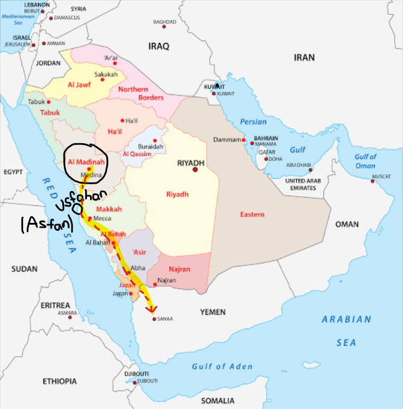

previous: [3. The story of Rabi'a b. Nasr b](./3_The_story_of_Rabia_Nasr.md)

### Lineology

[Ibn Ishaq ( اِبْنُ إِسْحَاقَ)](./Islamic%20scholars/Ibn%20Ishaq%20(%20اِبْنُ%20إِسْحَاقَ).md) stated that when the previously mentioned Rabia b Nasr died, all of the kingship has reverted back this person called Hassan b. Tubban Asad Abu Karib (حَسَّانُ بْنُ تُبَّانَ أَسْعَدَ أَبِي كَرِبٍ). 

Hassan was just a normal king. On the other hand, Asad Abu Karib was a Tubba, in fact the last Tubba. The title _Tubba‘_ wasn't just a synonym for "king"—it specifically designated a ruler who held unified dominion over the entirety of Yemen and its surrounding tribal confederations.

- **Tubban As'ad Abu Karib son of Kulki Karib b. Zayd**  achieved massive military conquests, expanding his reach into central Arabia and heading north toward the Levant. He was the last ruler to maintain that massive, unified empire.
- **Hassan b. Tubban**, while succeeding his father, faced immediate tribal fractures. His reign was heavily occupied by civil unrest and internal mutiny. According to the traditional narratives, he was ultimately assassinated by his own brother (Amr) because the army grew exhausted from continuous warfare. Because his reign marked the _collapse_ of the unified empire, many historians draw the line at his father.

Zayd, the first tubba , was the son of Amr Dhu al-Adhar b. Abraha Dhu al-Manar b. al-Raish b. Adi b. Sayfi b. Saba al-Asghar b. Ka'b Kahf aI Zulum b. Zayd b. Sahl b.  Amr b. Qays b. Mu'awiya b. jusham b. c Abd Shams b. Wail b. al-Ghawth b. Qatan b. c Arib b. Zuhayr b. Ayman b. al-Hamaysa b. al- c Aranjaj ( Himyar)

### Story of Asad abu Karib

His reign proceeded after that of Rabi‘a b. Nasr. Once, he went to east, through Madina. He passes through that place without bothering the inhabitants and also leaves his son there. But the people treacherously kills that son. He becomes so angry and decides to wipe out the people and cut down the palm trees.

Knowing about this threat, the people of *ansar*, joined up against him. They selected Amr b Talla as the leader. Amr b Talla was the brother of **Banu-al-Najjar**. Amr b Talla is of the tribe, Banu c Amr b. Mabdhul. Mabdhul’s name was c Amir b. Malik b. al-Najjar, and al-Najjar’s name was Taym Allah b. Tha'laba b. c A.mr b. al-Khazraj b. Harith b. Tha'laba b. c Amr b. 'Amir. (basically, he also trace back to Amr b Amir)

Basically, the story goes like this.. A man from the banu Adi b al-Najjar(ansar) named ***Ahmar***, saw one of the followers of the tubba cutting down date clusters off one of his date loaded palm trees. seeing this, he killed that person saying "Dates belong only to those who pollinate them." so the tubba became very angry and fight broke between those people.

An interesting thing that happens in the fight is that the people of the ansar, they say to the king, that they will fight him by the day and host him by the night.  

Now one theory (by ibn ishaq) suggest that actually the tubba was angry towards the jews but the ansar also fought with him to protect the jews. However another theory (by al suhayli) suggest that, actually, the tubba came to save his cousins (tubba is yemeni qahtani and his cousins being madani qahtani) from the jews because they broke some treaties between them and ansar.

Now Ibn Ishaq's story continues like this.

Tubba is already angry and want to destroy the city of Madina and he is in fight (probably outside of the city). Two deeply learned jewish rabbis from [banu qurayza](./z_jews/banu%20qurayza.md) arrive and told him, “O king, do not do this. Unless you adopt a different course from that you intend, you will be prevented from accomplishing it, and we will not be able to save you from swift retribution.” Tubba asked why this was so, and they replied, “This is where a prophet will migrate; he will go forth from this holy sanctuary from Quraysh in times to come and this shall be his home and his abode.”

Tubba was intrigued by the learnings they had and had changed the plan. Tubba and his people had the idols whom they worshipped (according to ibn Ishaq). But he adopted the religion of the rabbis and departed Madina.

Tubba is now going back to Yemen and was going through Mecca on his way (he dont know about Kaaba yet.) When he arrived between Usfan(عُسْفَانُ) and Amaj(أَمَجُ), he was approached by some men from the tribe *Hudhayi b. Mudrika b. Ilyas b. Mudar b. Nizar b. Ma'ad b. 'Adnan
(هُذَيْلُ بْنُ مُدْرِكَةَ بْنِ إِلْيَاسَ بْنِ مُضَرَ بْنِ نِزَارِ بْنِ مَعَدِّ بْنِ عَدْنَانَ)* 
They asked him, “O king, may we lead you to an ancient treasury overlooked by kings before yourself, in which there are pearls, chrysolite, sapphires, gold, and silver?” “Certainly you may,” he replied. They said, “It is a building in Mecca whose people worship it and offer prayers there.”

Actually the Hudhaylis sought to destroy him by this, since they knew that any king wanting this or being disrespectful there would perish.

After agreeing to their suggestion Tubba sent word to the two rabbis asking their advice. They replied, “Those people wished only your death and the destruction of your army. We know of no other building than that in the land that God Almighty and Glorious has taken for Himself. If you do as they suggest, you will perish, as will all those with you.”

Tubba c asked what he should do when he approached the building and they said he should do the same as those who lived there, that he should circumam¬ bulate it and venerate and honour it, shaving his head and acting with humility before it until he left it.

The king then asked, “What is it that prevents you both from doing the same?” They replied, “It certainly is the house of our father Abraham, on whom be peace, and it is as we told you, but the people there have created a barrier between us and it by the idols they have set up about it and the blood they shed there. They are unclean and polytheists.” This was the gist of their words.

Tubba saw the good of their advice and the truth of their words and so he summoned the men from *Hudhayl*, **cut off their hands and feet**, and continued to Mecca. 

There he performed the circumambulation of the building, made sacrifice, and shaved his head. He remained in Mecca for six days, so they say, providing sacrificial feasts for its people and giving them honey to drink. In a dream he was shown that he should cover the building, so he clothed it with palm fronds. Then, in another dream, he was shown that he should clothe it in something better, so he dressed it with a Yemeni tribal fabric. Again he had a vision that he should clothe it even better, so he covered it with fine sheets and striped cloth. People claim that Tubba  was thus the first to clothe the building. He ordered its guardians from the *Jurhum* tribe to clean it thoroughly and to prevent any blood, dead bodies, or menstruating women from coming close to it. He also made for it a door and a key.

Ibn Ishaq continued: “Thereafter Tubba  left for Yemen, taking his armed men and the two rabbis with him. On his arrival **he asked his people to adopt the religion** he had embraced, but they refused until it should be put to the test of fire as was the custom in Yemen.

 when Tubba  reached the outskirts of Yemen, Himyar (the yemeni arabs) intercepted him and denied him entry. They told him, ‘You shall not enter our land; you have abandoned our faith.’ So Tubba  called on them to embrace his new religion, proclaiming it to be better than theirs. They asked whether he would agree to put the issue  between them to the test of the fire, and he agreed.
 
 Basically in Yemen, as Yemenis assert, a fire they would employ to adjudicate differences; it would consume wrongdoers but not harm the innocent. And so Tubba ’s people and the two rabbis walked to the fire site. His people took their idols and carried their sacrificial offerings, while the rabbis wore their sacred books around their necks. They all sat near the spot from which the fire would emerge. When it raged towards them they drew away and avoided it. The onlookers berated them and ordered them to endure it, and they did so until it enveloped them and consumed their idols and sacred objects and those men of Himyar who carried them. But the two rabbis emerged safe, with their holy books around their necks, unharmed though their foreheads were sweating. Thereupon the Himyarites adopted their religion; and this was how Judaism began in Yemen.

 Ibn Ishaq continued to report that one authority told him that the two rabbis and the men of Himyar approached the fire only seeking to force it back, for it was said that truth lay with him who could do this. The Himyarites approached the fire bearing their idols to force it back, but it closed on them seeking to consume them. So they drew away and were not able to force it back. Later the two rabbis approached it and began reciting the Torah. The fire withdrew from them and so they forced it back to where it emerged. Thereupon the Himyarites adopted their religion. But God knows best which report is true.

 They had a temple called Ri'am which they venerated and where they made sacrifice; there they received oracular messages while engaged in their polytheistic practices. The two rabbis told Tubba , ‘It is just a devil who is deceiving the people that way; let us deal with him.’ Tubba agreed with the rabbis, so the Yemenis, forced out from it a black dog which they killed. Then they destroyed that temple; and its ruins still to this day bear traces of the blood shed on it.

Prophet (SAW) said not to curse Tubba because he had become a Muslim.

According to al-Suhayli, Tubba spoke the following verses when the two rabbis told him about the Messenger of God (SAAS):

*“I do testify that Ahmad is a messenger from God, guiltless his soul,*
*If only my life were extended up to his, I would have been a helper, a cousin to him, I would have fought his enemies with the sword and cleared all cares from his breast.”*

These verses continued to be handed down and memorised among the ansar; they were with Abu Ayyub al-ansari, may God be pleased with him and bless him.

Al-Suhayll stated that Ibn Abu al-Dunya indicated in his Kitab al-Qubur {Book of Graves) that a grave was dug up at San'a in which two females were found and along with them a silver tablet on which was written in gold, “**This is the grave of Lamis and Hubba, two daughters of Tubba** , who died declaring, ‘There is no God but God alone and without peer,’ and before them the righteous had died saying the same.”

## passing of rule to Hassan and then to his brother who killed him

Later, rule passed to Hassan b. Tubban Asad, and he was the brother of al-Yamama al-Zarqa  who was crucified on the gate of the city of Jaw, which from that day on was named al-Yamama.

Ibn Ishaq continued that when Tubba ’s son Hassan b. Abi Karib Tubban As'ad became king, he set out with the people of Yemen, wishing to subdue (bring under control) the lands of the Arabs and the Persians. But by the time they were somewhere in Iraq, the Himyarites and the Yemenites disliked going further with him and wanted to return to their own countries and families. 
So they spoke to a brother of Hassan named **Amr**, who was there with him in the army, as follows: 

“Kill your brother Hassan and we will make you king over us and you can take us back home.” 

He said he would, and there was agreement about this except in the case of DhuRu'ayn the Himyarite. He urged Amr against this, but 'Amr disagreed. So DhuRu'ayn composed a poem containing the following two

verses:
*“Whoever would exchange insomnia for sleep? Happy he who sleeps in peace.*
*Though Himyar has betrayed in treachery, DhuRu'ayn has God’s forgiveness*

This poem he then entrusted to Amr. When the latter did kill his brother Hassan and returned to Yemen, he was deprived of sleep and suffered insomnia. When he asked physicians, astrologists, soothsayers, and diviners what was wrong, they told him, “No one has ever killed his brother or relative unjustly without losing his sleep and suffering insomnia.” Thereupon he set about killing all those who had encouraged him to murder his brother. Finally, he came to Dhu Ru'ayn who told him, “I have cause for you to spare me.” When ( Amr asked why, he drew attention to the document he had entrusted to him. 'Amr then took out the verses, read them and realized that Dhu Ru'ayn had advised him well.  

**Amr perished and Himyar’s state fell into disorder and disarray.**

# summary:

Tubba asad abu karib : goes to Madina converts to muslim, clothes kaaba and comes to Yemen and changes the religion of the people by surviving the fire

Hassan is Tubba's successor, he went to expand Yemen, but his army disliked and adviced Amr to kill him so he can become the king

Amr killed him but suffered insomnia so he killed all who told him to kill Hassna except Dhu Ru'ayn who already adviced him not to kill

Amr perished and Himyar’s state fell into disorder and disarray

next: [5 Usuruption of Throne](./5_Usurpation_of_the_Throne_of_Yemen.md)